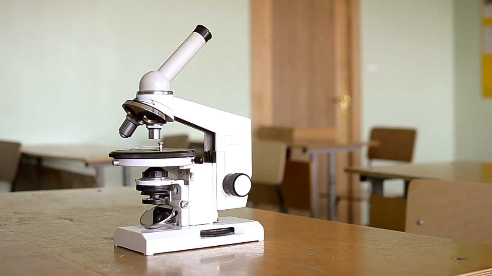

# Научный метод — инструкция к миру 🔬

Научный метод — это как волшебный рецепт, по которому учёные разгадывают загадки природы. Он помогает отличить правду от вымысла и превратить простое "почему?" в настоящее открытие!

## 5 шагов научного метода:

1. **[Наблюдение](../scientific-method/watching.md)** 👀
   Замечаем что-то интересное:
   *"Почему осенью паутины больше, чем летом?"*

2. **[Гипотеза](../scientific-method/hypotesis.md)** 💭
   Предполагаем ответ (который можно проверить!):
   *"Может, пауки активнее плетут сети перед холодами?"*

3. **Эксперимент** 🧪
   Проверяем [догадку](../scientific-method/hypotesis.md):
   - Считаем паутины в сентябре и июле
   - Наблюдаем за пауками при разной температуре

4. **[Анализ](../data-collection-and-analysis/analysis.md)** 📊
   Сравниваем результаты:
   *"В сентябре пауков действительно больше!"*

5. **Вывод** 🎯
   Делаем заключение или строим **[теорию](../scientific-method/theory.md)**:
   *"Пауки чувствуют смену сезонов и готовят ловушки для мигрирующих насекомых"*

> 🌟 Пример: Так Чарльз Дарвин, наблюдая за вьюрками на Галапагосах, создал [теорию](../scientific-method/theory.md) эволюции!

## Главные правила:
- **Повторяемость**: Эксперимент должен давать одинаковый результат у всех
- **Честность**: Если [гипотеза](../scientific-method/hypotesis.md) не подтвердилась — это тоже результат!
- **Любопытство**: Настоящие учёные всегда задают новые вопросы

## Попробуй сам! Исследуй:
### 🍞 Почему хлеб становится твёрдым?
1. **[Наблюдение](../scientific-method/watching.md)**: Вчерашний хлеб твёрже свежего
2. **[Гипотеза](../scientific-method/hypotesis.md)**: *"Наверное, из него испаряется вода"*
3. **Эксперимент**:
   - Взвесь свежий хлеб
   - Оставь на сутки
   - Взвесь снова
4. **Результат**: Если вес уменьшился — [гипотеза](../scientific-method/hypotesis.md) верна!
### 🌈 Почему мыльные пузыри переливаются?
1. **[Наблюдение](../scientific-method/watching.md)**: На пузырях видны цветные разводы
2. **[Гипотеза](../scientific-method/hypotesis.md)**: *"Может, свет отражается как в радуге?"*
3. **Проверка**: Посвети фонариком на пузырь — цвета станут ярче!

🔍 **Помни**: Настоящая наука — это когда ты готов изменить своё мнение, если факты показывают другое. Вчерашняя [гипотеза](../scientific-method/hypotesis.md) может стать завтрашней [теорией](../scientific-method/theory.md), а потом — основой для новых открытий!

*Научный метод — это суперспособность, которая есть у каждого: нужно лишь быть внимательным, сомневаться и не бояться экспериментировать!*