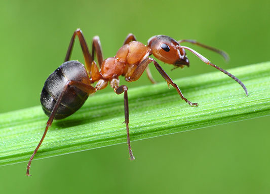

# Наблюдение — первый шаг к открытиям 🔍

Наблюдение — это когда учёные (и ты тоже!) внимательно разглядывают мир вокруг, чтобы заметить что-то интересное. Это как игра в детектива: нужно записывать, зарисовывать или запоминать всё необычное.

## Как устроен процесс наблюдения?
1. **Замечаем странное** 👀:
   *Пример*: Почему осенью листья желтеют, а не синеют?
2. **Пытаемся объяснить** 🤔:
   *"Может, дерево как-то чувствует холод?"* — это пока просто [догадка](../scientific-method/hypotesis.md), которую нужно проверить.
3. **Ищем закономерности** 📊:
   Записываем каждый год: когда листья меняют цвет, какая была погода.
4. **Сравниваем с другими фактами** 🌍:
   А в тёплых странах листья тоже желтеют?

> 🧩 **Важно!** Сначала учёные строят *[предположения](../scientific-method/hypotesis.md)* на основе наблюдений, а потом годами их проверяют. Например, люди веками думали, что Солнце вращается вокруг Земли — пока не накопили достаточно доказательств обратного.

## Примеры для экспериментов:
### 🐜 Муравьиная кухня
- **Наблюдение**: Муравей тащит в муравейник зёрнышко в 10 раз больше себя.
- **Проверка**: Положи рядом сахар и хлеб — что выберут?
- **Вывод**: Их выбор помогает понять *правила* их "продуктового магазина".

### 🌈 Цветные тени
- **Наблюдение**: Если скрестить свет двух фонариков, тень может стать фиолетовой!
- **Проверка**: Поэкспериментируй с красным и синим светом.
- **Объяснение**: Так появляются *идеи* о том, как смешиваются цвета.

## Как маленькие "почему" становятся большими открытиями?
Сначала ты видишь, что лужа замерзает только в мороз. Потом замечаешь, что на солнце лёд тает быстрее, то есть выдвигаешь [гипотезу](../scientific-method/hypotesis.md). А через годы учёные, собрав тысячи таких наблюдений, понимают, как свет и тепло влияют на вещество, составляя [теорию](../scientific-method/theory.md).

🔭 **Попробуй!** Заведи "Дневник Наблюдателя" и отмечай:
- Сколько времени ворона копается в пакете с мусором?
- Куда чаще дует ветер — на север или юг у твоего дома?