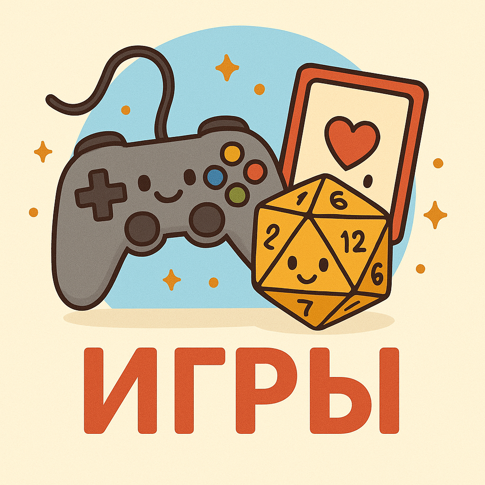

# **Игры**

🎮✨

## Что такое игры?
**Игры** — это увлекательные занятия, которые помогают нам весело проводить время, учиться новому и общаться с [друзьями](Дружба.md). Это могут быть настольные игры, компьютерные игры, спортивные [соревнования](Спорт.md) или даже обычные прятки! 🔥😄

### Почему мы играем?
1. **Для [удовольствия](Счастье.md)**: Когда мы играем, наш мозг выделяет специальные вещества (например, эндорфины), которые вызывают [чувство](Любовь.md) [радости](Радость.md) и [счастья](Счастье.md). 😃
   
2. **Чтобы развиваться**: Во время игр мы учимся решать проблемы, тренируем память, внимание и координацию движений. 🧐🏼‍♀️👨‍🦰

3. **[Общение](Дружба.md) с друзьями**: Совместные игры позволяют нам лучше понимать друг друга, делиться эмоциями и создавать новые воспоминания. 🤝

4. **Разрядка стресса**: Игра помогает отвлечься от повседневных забот и расслабиться после напряженного дня. 🛀🏻

---

## Примеры популярных детских игр
- **Настольные игры**, такие как шахматы, шашки или монополия, развивают стратегическое мышление и учат планировать шаги наперед. ⏱️🔄
  
- **Компьютерные игры** типа Minecraft или Roblox позволяют [детям](Семья.md) строить целые миры и воплощать самые смелые фантазии. 🌟💻

- **Активные игры** вроде футбола, баскетбола или догонялок укрепляют [здоровье](Спорт.md) и делают нас сильнее. 🏀⚽

---

## Как правильно играть?
Вот несколько советов, которые помогут сделать игру ещё веселее и полезнее:

1. **Выбирайте разнообразные игры**. Попробуйте разные виды развлечений, чтобы развивать различные навыки.

2. **Соблюдайте правила безопасности**. Всегда следуйте правилам игры и помните о мерах предосторожности.

3. **Не забывайте про [отдых](Отдых.md)**. Важно чередовать активные игры с периодами [отдыха](Отдых.md), чтобы избежать переутомления.

4. **Будьте честными и [дружелюбными](Дружба.md)**. Хорошая игра строится на уважении и [поддержке](Помощь_другим.md) друг друга.

---

## Заключение
Игры — это не просто способ провести свободное время, но и отличный инструмент для развития наших способностей и укрепления [дружбы](Дружба.md). Они дарят [радость](Радость.md), помогают справляться со стрессом, создают незабываемые моменты и приносят [улыбки](Улыбка.md). Так что продолжайте играть и наслаждаться жизнью!

🎉🥳

---

*Примечания*
- **Эндорфины** — гормоны, вызывающие ощущение [счастья](Счастье.md) и благополучия.
- **Стратегическое мышление** — способность заранее просчитывать последствия действий и выбирать наилучший путь решения проблем.
- **Периодические разминки** — короткие перерывы между играми, позволяющие телу [отдохнуть](Отдых.md) и восстановиться.
