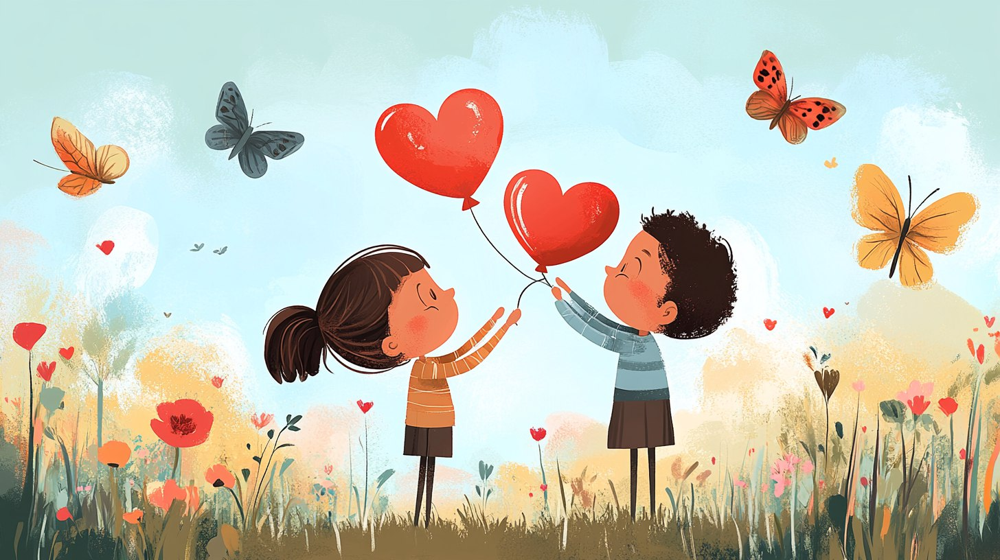

# **Любовь** 💖

## Что такое любовь?

Любовь — это чувство глубокой привязанности и [заботы](Семья.md) о ком-то или чём-то. Это когда тебе хочется заботиться о другом человеке, радовать его и поддерживать в трудные моменты. Любить можно не только людей, но и [животных](Природа.md), [природу](Природа.md), [хобби](Хобби.md) и даже [еду](Еда.md)!

### Примеры любви вокруг нас:
- Когда мама готовит твою любимую [еду](Еда.md), она делает это с любовью ❤️.
- Когда папа помогает тебе собрать конструктор, он показывает свою [заботу](Семья.md).
- [Дружба](Дружба.md) между друзьями тоже основана на любви — ведь вы поддерживаете друг друга и радуетесь вместе 😊.
- А ещё есть любовь к [природе](Природа.md)! Например, уход за [растениями](Природа.md) или прогулки в [лесу](Природа.md) приносят [радость](Улыбка.md) и помогают нам чувствовать себя ближе к миру [природы](Природа.md) 🌿.

---

## Как проявляется любовь?

1. **[Забота](Семья.md)**: Это когда ты делаешь что-то хорошее для другого человека, зная, что это принесёт ему [радость](Улыбка.md).
   - Пример: Помочь бабушке перейти дорогу или подарить другу подарок на день рождения 🎁.
   
2. **[Поддержка](Помощь_другим.md)**: Быть рядом в трудные моменты и подбадривать словами или действиями.
   - Пример: Если твой друг расстроился, можно предложить поиграть вместе или послушать [музыку](Музыка.md) 🎶.

3. **Понимание**: Важно уметь выслушать и попытаться понять чувства другого человека.
   - Пример: Иногда нужно просто помолчать и позволить человеку выговориться 🗣️.

4. **Самопожертвование**: Готовность отдать своё время, силы или ресурсы ради кого-то.
   - Пример: Пойти гулять с младшим братом, хотя ты хотел играть в компьютерные [игры](Игры.md) 🕹️.

5. **Теплота и нежность**: Проявлять внимание через объятия, [улыбки](Улыбка.md) и добрые слова.
   - Пример: Сказать маме, что ты её любишь перед сном 💫.

---

## Почему важно любить и быть любимым?

Когда мы чувствуем любовь, наше сердце наполняется [радостью](Улыбка.md) и [счастьем](Счастье.md) 💛. Мы становимся добрее и сильнее, потому что знаем, что можем рассчитывать на [поддержку](Помощь_другим.md) близких. Люди, окружённые любовью, легче справляются с проблемами и быстрее достигают целей.

---

## Заключение

Любовь — это волшебное чувство, которое объединяет людей и делает мир лучше 🌈. Она помогает нам становиться настоящими героями для тех, кто нам дорог. Так что не забывай проявлять свою любовь каждый день — пусть она согревает сердца окружающих тебя людей! 🙌🏻🙌🏼🙌🏽🙌🏾🙌🏿

---

## Термины

- **[Забота](Семья.md)**: Действие, направленное на улучшение состояния или настроения другого человека.
- **[Поддержка](Помощь_другим.md)**: Оказание помощи или моральной [поддержки](Помощь_другим.md) в сложных ситуациях.
- **Понимание**: Способность почувствовать эмоции и мысли другого человека.
- **Самопожертвование**: Отказ от собственных желаний ради блага другого.
- **Теплота и нежность**: Выражение чувств через прикосновения, слова и поступки.

---

❤️ Пусть твоя жизнь будет наполнена любовью и добротой!