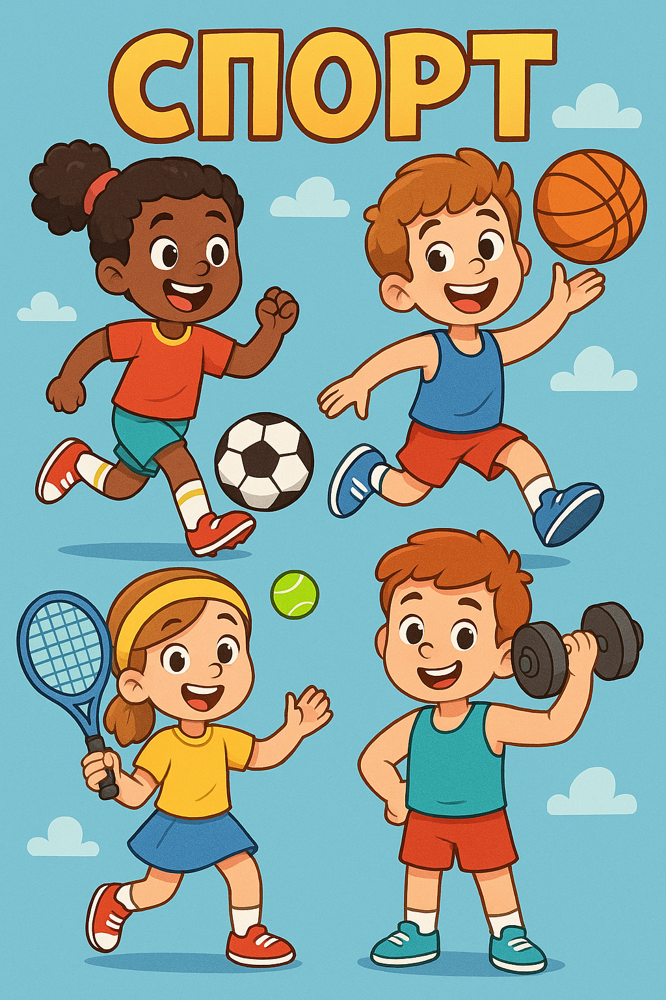

# **СПОРТ** 🏋️‍♀️🏆

## Что такое спорт?

**Спорт** — это физическая активность, направленная на развитие тела, укрепление здоровья и достижение результатов через соревнования или тренировки. Занятия спортом помогают поддерживать форму, улучшают настроение и способствуют развитию важных качеств, таких как дисциплина, упорство и командный дух.

---

### Почему спорт важен?

- **Здоровое тело**: Регулярные занятия спортом укрепляют мышцы, [сердце](Любовь.md) и легкие, помогая организму лучше справляться с нагрузками и болезнями.
  
- **Хорошее настроение**: Во время тренировок организм вырабатывает эндорфины — гормоны [радости](Улыбка.md), которые делают нас счастливее!

- **Развитие полезных привычек**: Заниматься спортом регулярно помогает научиться дисциплине и планировать свое время грамотно.

- **Социальная жизнь**: Многие виды спорта предполагают участие в командах, где каждый игрок должен взаимодействовать с другими. Это способствует [дружбе](Дружба.md) и взаимопониманию.

---

### Примеры спортивных увлечений для детей:

1. **Футбол** ⚽ — [игра](Игры.md), в которой участвуют две команды по 11 человек. Основная цель — забить мяч в ворота соперника ногами или головой. Футбол развивает выносливость, координацию движений и умение работать в команде.
   
   *Пример*: Если ты хочешь стать настоящим футболистом, тренируй удары по воротам и учись играть с друзьями в дворовый футбол! Так ты сможешь быстрее овладеть основными навыками [игры](Игры.md).

2. **Плавание** 🛅 — вид спорта, который укрепляет практически все группы мышц и улучшает работу [сердца](Любовь.md). Плавание полезно для тех, кто хочет иметь красивую осанку и крепкое здоровье.

   *Пример*: Попробуй записаться в бассейн и научись разным стилям плавания (брасс, кроль). Со временем ты заметишь, насколько легче тебе стало преодолевать большие расстояния в воде!

3. **Баскетбол** 🏀 — популярная [игра](Игры.md), в которой нужно забросить мяч в кольцо противника. Баскетбол отлично подходит для развития реакции, ловкости и умения быстро принимать решения.

   *Пример*: Играть в баскетбол можно даже во дворе с друзьями. Начни с простых упражнений: бросок мяча одной рукой и передача партнеру.

4. **Гимнастика** ✨ — включает различные упражнения на гибкость, силу и балансировку. Гимнасты выполняют сложнейшие элементы на снарядах вроде брусьев, колец и бревна.

   *Совет*: Хочешь попробовать себя в гимнастике? Запишись в секцию и начни осваивать базовые движения, такие как мостик и стойка на руках.

5. **Легкая атлетика** 🏃‍♂️ — бег, прыжки и метания составляют основу легкой атлетики. Этот вид спорта подойдет активным [детям](Семья.md), желающим развивать скорость и силу.

   *Идея*: Пробеги несколько километров в парке вместе с [родителями](Семья.md) или устрой соревнование с друзьями по дальности прыжков.

---

### Советы начинающим спортсменам:

- Найди тот вид спорта, который приносит тебе [радость](Улыбка.md) и [удовольствие](Счастье.md).
- Не бойся пробовать новое — иногда самые интересные открытия происходят случайно.
- Тренировки требуют регулярности, но важно помнить про [отдых](Отдых.md) между ними.
- Собирай команду друзей, чтобы заниматься спортом было веселее и интереснее.

---

### Заключение:

Занятие спортом — это отличный способ укрепить своё физическое состояние, развить полезные качества и найти новых друзей. Важно выбрать такой вид активности, который будет приносить [радость](Улыбка.md) и удовлетворение. Так ты точно станешь здоровее и счастливее!

---

### Дополнительные определения:

- **Эндорфины** — природные вещества в организме человека, вызывающие [чувство](Любовь.md) эйфории и [счастья](Счастье.md) после физической нагрузки.
- **Выносливость** — способность организма выдерживать длительные физические нагрузки без сильного утомления.
- **Командный дух** — взаимное доверие и [поддержка](Помощь_другим.md) среди членов команды, направленные на достижение общей цели.

💪✌️🔥