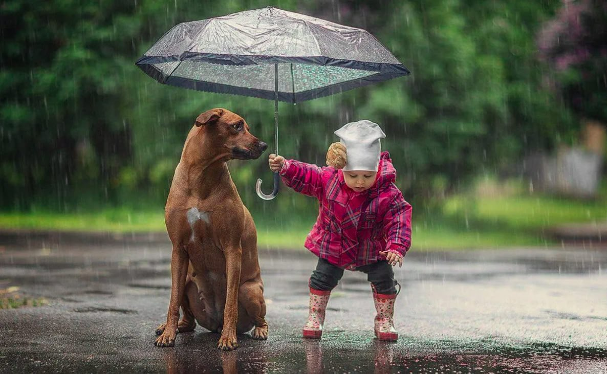

# Доброта

**Что такое доброта?**

1. Доброта - это когда ты делаешь что-то хорошее для других людей или животных без ожидания получить что-то взамен. Это может быть помощь другу с домашним заданием, уступка места в автобусе пожилому человеку или даже просто улыбка незнакомцу на улице.

2. Доброта бывает разной: можно помочь другу найти потерявшуюся игрушку, а можно поделиться своими игрушками с другом, который не имеет столько же игрушек, сколько ты. Доброта может проявляться в словах и действиях.

3. Важно помнить, что доброта делает мир лучше. Когда мы добры к другим, они чувствуют себя счастливее, а значит, и весь мир становится немного светлее. Например, если ты поможешь маме с уборкой дома, она будет рада и благодарна тебе.

4. Иногда доброта требует от нас жертв. Например, ты можешь отказаться от любимой игры, чтобы помочь другу с его домашней работой. Но помни, что твои усилия обязательно вернутся к тебе в виде хорошего настроения и чувства удовлетворения.

5. Доброта заразительна. Если ты проявишь доброту к кому-то, этот человек, скорее всего, тоже станет добрее и захочет сделать что-то хорошее для кого-то еще. Представь себе цепочку добра!

**Заключение:**

Доброта - это то, что делает наш мир лучше. Она помогает нам становиться лучшими версиями самих себя и строить крепкие отношения с другими людьми. Проявлять доброту - это как дарить миру маленькие подарки, которые делают его ярче и радостнее.

