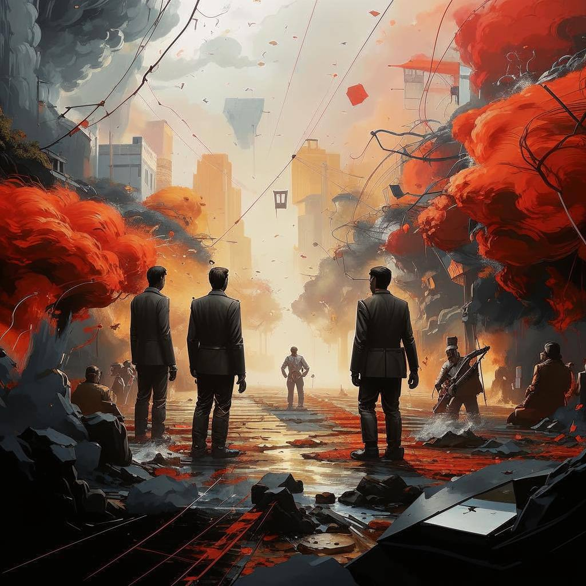

# Конфликты

### Конфликты

#### Что такое конфликты?

Конфликты — это ситуации, когда люди не соглашаются друг с другом или спорят о чем-то важном для них. Это может происходить из-за разных мнений, желаний или интересов. Конфликты бывают между друзьями, членами [семьи](./семья.md), коллегами на работе и даже незнакомыми людьми. Они могут возникать из-за различных причин: от простых недоразумений до серьезных разногласий.

#### Почему возникают конфликты?

Причины конфликтов могут быть разными. Иногда они связаны с личными особенностями людей: например, кто-то может быть более упрямым или требовательным. Также причиной конфликта может стать недостаток [общения](./общение.md) или понимания между людьми. Когда мы не знаем, что чувствует другой человек или почему он поступает определенным образом, это может привести к недопониманию и последующему конфликту.

#### Как можно избежать конфликтов?

Чтобы предотвратить конфликты, важно научиться слушать других и стараться понять их точку зрения. Если вы чувствуете, что назревает спор, попробуйте обсудить проблему спокойно и открыто. Обсуждение помогает людям выразить свои чувства и найти компромиссное решение. Важно также проявлять [уважение](./уважение.md) к мнению другого человека, даже если оно отличается от вашего.

#### Как разрешить уже возникший конфликт?

Если конфликт все же произошел, есть несколько способов его разрешения. Один из них — это диалог. Постарайтесь сесть и спокойно обсудить проблему вместе с другим человеком. Выслушайте его точку зрения и постарайтесь объяснить свою. Возможно, вам удастся найти общее решение, которое устроит обе стороны.

Еще один способ — это поиск компромисса. Иногда можно найти решение, которое будет устраивать всех участников конфликта. Например, если двое друзей спорят из-за игрушки, они могут договориться поделить ее время от времени.

Также полезно иногда обратиться за помощью к кому-то третьему, кто может помочь разобраться в ситуации и предложить конструктивные решения. Это может быть взрослый, которому дети доверяют, или даже школьный психолог.

#### Заключение

Конфликты неизбежны, но они не всегда плохи.

