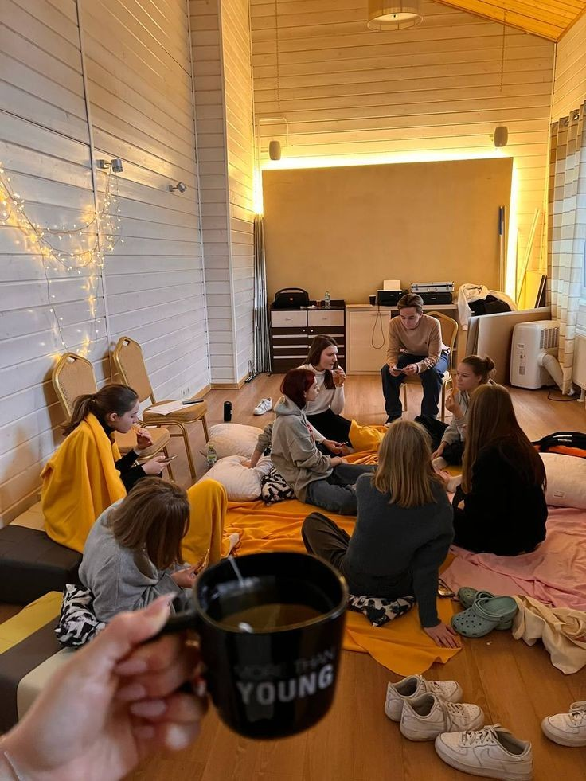

# Общение

### Общение

#### Что такое общение?

Общение — это процесс обмена мыслями, чувствами и информацией между людьми с помощью слов, жестов или других средств. Это важная часть нашей жизни, которая помогает нам понимать друг друга, строить отношения и работать вместе. Мы общаемся каждый день: когда разговариваем с друзьями, учителями, родителями или даже с незнакомыми людьми.

#### Зачем нужно общаться?

Общение помогает нам делиться своими идеями, мыслями и чувствами. Оно позволяет нам учиться у других людей, получать [поддержку](./поддержка.md) и помощь. Когда мы общаемся, мы можем узнать что-то новое, обсудить свои проблемы и найти решения. Кроме того, общение помогает нам строить [дружбу](./дружба.md) и поддерживать хорошие отношения с другими людьми.

#### Как люди общаются?

Существует несколько способов общения. Один из них — вербальное (словесное) общение. Мы используем слова для передачи информации. Другой способ — невербальное общение, которое включает в себя жесты, мимику и другие несловесные сигналы. Например, когда мы улыбаемся или киваем головой, мы передаем свои эмоции без использования слов.

#### Почему важно уметь хорошо общаться?

Умение хорошо общаться важно, потому что оно помогает нам достигать целей, решать [конфликты](./конфликты.md) и строить крепкие отношения. Люди, которые умеют ясно выражать свои мысли и слушать других, обычно более успешны в учебе, работе и личной жизни. Хорошие коммуникативные навыки также помогают нам лучше понимать окружающих и чувствовать себя увереннее в обществе.

#### Вывод

Общение — это основа наших отношений с другими людьми. Оно помогает нам делиться своими мыслями и чувствами, учиться новому и решать проблемы. Важно уметь не только говорить, но и слушать, ведь это помогает нам лучше понять других и наладить с ними контакт. Умение общаться делает нашу жизнь интереснее и богаче, позволяя нам строить крепкие и доверительные отношения с окружающими.

