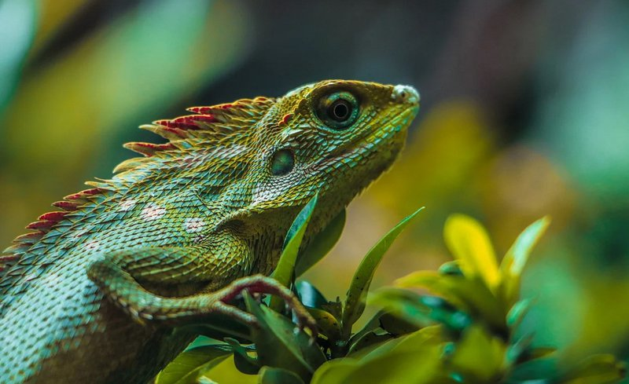
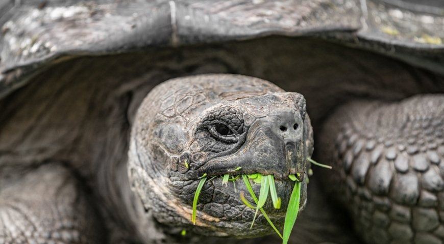

# Рептилии - наши чешуйчатые друзья 🦎

Привет, дружок! 👋 Сегодня я расскажу тебе о рептилиях - очень интересных животных!

## Кто такие рептилии? 🤔

Рептилии - это животные с сухой чешуйчатой кожей. Их ещё называют пресмыкающимися. К ним относятся:

- 🐊 Крокодилы
- 🐢 Черепахи
- 🦎 Ящерицы
- 🐍 Змеи

## Чем рептилии отличаются от других животных? 🧐

Рептилии особенные! Вот что делает их непохожими на других животных:

1. У них **чешуйчатая кожа** вместо шерсти или перьев
2. Они **откладывают яйца** на суше
3. Они **холоднокровные** - это значит, что температура их тела зависит от окружающей среды

## Где живут рептилии? 🏠

Рептилии живут почти везде:
- В жарких пустынях
- В тропических лесах
- В океанах и реках
- Даже в наших садах!

Но большинство рептилий любят тёплые места, потому что им нужно греться на солнышке! ☀️

## Чем питаются рептилии? 🍽️

Разные рептилии едят разную пищу:
- Крокодилы едят рыбу и других животных
- Многие черепахи едят растения
- Ящерицы любят насекомых
- Змеи глотают свою добычу целиком! 😲

## Интересные факты о рептилиях 🌟

- Некоторые ящерицы могут отбрасывать хвост, если их схватить! Потом хвост отрастает снова! 😮
- Черепахи могут жить очень долго - некоторые больше 100 лет! 🐢
- У крокодилов самый сильный укус среди всех животных! 🐊
- Змеи не моргают, потому что у них нет век! 👁️

## Заключение

Рептилии - удивительные животные! Они живут на нашей планете уже очень-очень давно, даже динозавры были рептилиями! 🦖

Надеюсь, теперь ты знаешь больше об этих классных чешуйчатых созданиях! 🦎❤️
