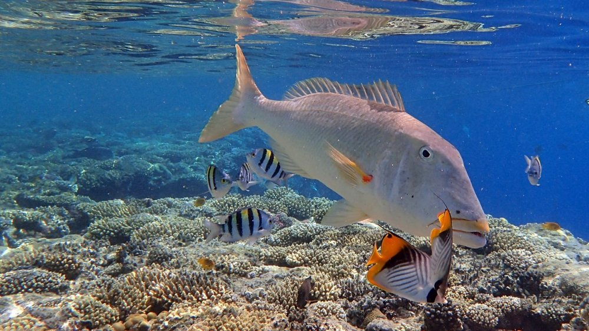
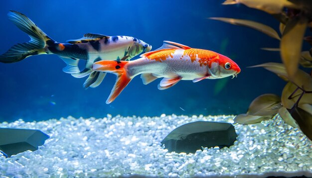
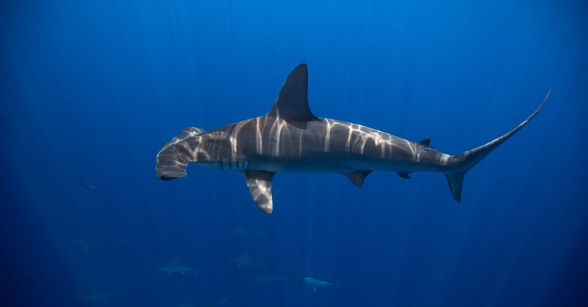

# 🐠 Кто такие рыбы?

Привет, друг! 👋 Давай разберёмся, кто такие рыбы! 🤔

## 🦁 Все рыбы — это животные! 🐠

Как кошки 🐱, собаки 🐶 или львы 🦁 — рыбы тоже животные! Но есть одно отличие: рыбы живут в воде! 🌊

## 🌊 Где живут рыбы?

Рыбы живут в морях 🌊, реках 🏞 и озёрах 🏕. Они не могут дышать воздухом, как мы, поэтому дышат водой с помощью жабр. 🫧

## 🐟 Как выглядят рыбы?

Рыбы бывают разными! Они могут быть:

- Маленькими 🐠 или большими 🐋
- Разноцветными 🎨
- Быстрыми 🚀
- Медленными 🐌

У всех рыб есть плавники, чтобы плавать, и хвост, который помогает им двигаться! 🏊‍♂️

## 🍽 Что едят рыбы?

Некоторые рыбы кушают водоросли 🌿, а другие — маленьких животных 🦐. Есть даже рыбы, которые охотятся, как акулы! 🦈

## 🎣 Интересные факты про рыб

- Самая маленькая рыбка — всего 1 см! 📏
- Самая большая рыба — китовая акула! Она может быть больше автобуса! 🚌
- Рыбы могут жить и в холодной воде ❄, и в тёплой 🏝.

Теперь ты знаешь, кто такие рыбы! 😃 Если увидишь их в аквариуме 🐠 или пруду 🌊, сможешь рассказать друзьям! 👍