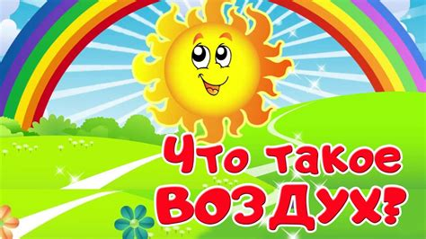
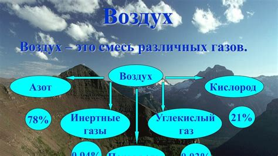
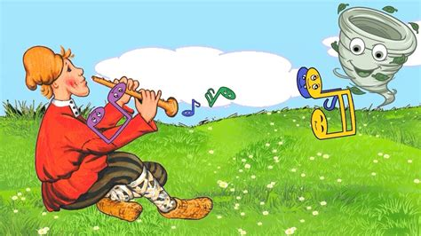


# Что такое воздух? 🌬️

Привет, друг! 👋 Давай поговорим о том, что такое воздух и почему он так важен для всего живого.

Воздух — это невидимая смесь газов, которая окружает нашу планету. 🌎 Он состоит в основном из азота (78%) и кислорода (21%). Хотя мы его не видим, он всегда рядом и помогает нам дышать. Попробуй задержать дыхание на несколько секунд — ты сразу почувствуешь, как важен воздух! 😃

## Почему воздух важен? 🏞️

Все живые существа — люди, [животные](https://github.com/mikromalekula1100/2025_kidbook/blob/main/KIDBOOK/world/nature/животные.md) и [растения](https://github.com/mikromalekula1100/2025_kidbook/blob/main/KIDBOOK/world/nature/растения.md) — нуждаются в воздухе для дыхания. Когда мы вдыхаем, наш организм получает кислород, который необходим для жизни. Без воздуха мы не смогли бы существовать.

## Интересные факты о воздухе 🌪️

-   **Воздух невидим**, но мы можем почувствовать его, когда дует ветер или когда надуваем воздушный шарик. 🎈
    
-   **Воздух имеет вес**. Хотя он кажется легким, воздух оказывает давление на все вокруг нас.
    
-   **Воздух может быть загрязненным**. Когда в воздух попадают вредные вещества, это может быть опасно для здоровья людей, животных и растений.
    

## Как заботиться о чистоте воздуха? 🍃

-   **Сажать деревья и растения**. Они помогают очищать воздух и производят кислород. 🌳
    
-   **Меньше использовать машины**. Ходить пешком или ездить на велосипеде помогает уменьшить загрязнение воздуха. 🚶‍♂️🚴‍♀️
    
-   **Не сжигать мусор**. Дым от сжигания загрязняет воздух и вредит здоровью.
    

Помни, чистый воздух важен для всех нас! Давай вместе заботиться о нашей планете и дышать полной грудью! 😊
