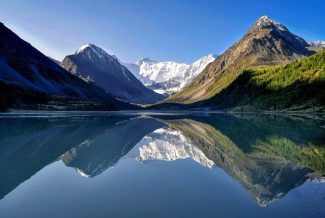
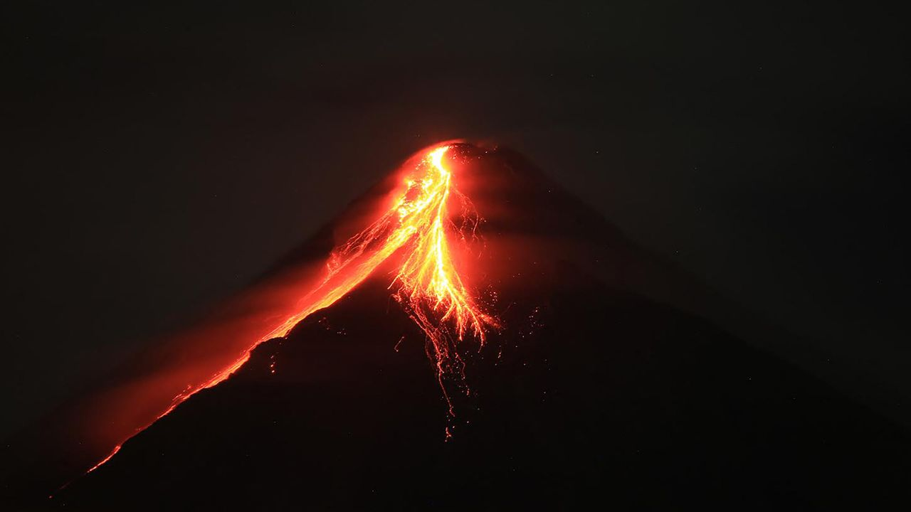


# 🏔️ Горы — удивительные великаны!

## 🌍 Что такое горы?

Горы — это огромные холмы, которые поднимаются высоко над землёй! 🏞️ Они могут быть такими высокими, что их вершины касаются облаков. Некоторые горы покрыты снегом, а другие — зелёными лесами. Узнай больше о природе! 🌱

## 🔥 Как появляются горы?

Горы рождаются, когда огромные куски земли — тектонические плиты — сталкиваются друг с другом и поднимают землю вверх! ⛰️ А ещё бывают горы, которые появляются из-за извержений вулканов, когда лава застывает и образует высокие пики. 🌋

## 🏔️ Какие бывают горы?

Горы бывают разные:

-   **Складчатые горы** 🏞️ — они появились, когда земля складывалась, как гармошка. Пример — Альпы!
    
-   **Вулканические горы** 🌋 — это застывшие вулканы, как гора Фудзи в Японии.
    
-   **Складчато-глыбовые горы** ⛰️ — появились из-за землетрясений. Пример — Уральские горы в России.
    

## 🐻 Кто живёт в горах?

В горах можно встретить много интересных животных! 🦅 Здесь живут орлы, снежные барсы и даже горные козлы! 🏔️ А на лугах растут красивые цветы — например, эдельвейсы. Познакомься с горными [животными!](https://github.com/mikromalekula1100/2025_kidbook/blob/main/KIDBOOK/world/nature/животные.md) 🐾

## ⛰️ Самые известные горы

-   **Эверест** 🏔️ — самая высокая гора на Земле! Её высота 8 848 метров!
    
-   **Килиманджаро** 🌋 — самая высокая гора Африки, а ещё это потухший вулкан!
    
-   **Эльбрус** ⛰️ — самая высокая гора в России и Европе!
    

## 🤯 Интересные факты о горах

-   Горы занимают **40%** всей суши на нашей планете! 🌍
    
-   В горах рождаются реки, которые потом текут по всей Земле! 💦
    
-   Чем выше гора, тем холоднее там становится! 🥶
    

## 🎒 Если ты пойдёшь в горы…

Важно помнить о безопасности! В горах погода может меняться очень быстро 🌦️, поэтому нужно одеваться тепло и брать с собой карту, воду и еду. А ещё лучше ходить в горы вместе с взрослыми! 🏕️

## 🏔️ Итог

Горы — это настоящие великаны природы! 🌍 Они делают нашу планету красивее, а ещё там живёт много удивительных существ! 🐻 Изучая горы, мы узнаём, как устроен наш мир.

