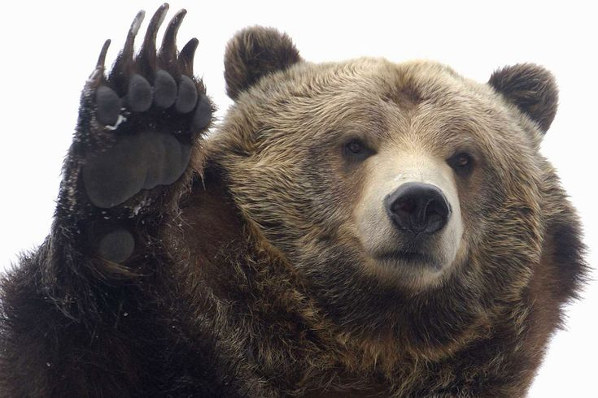
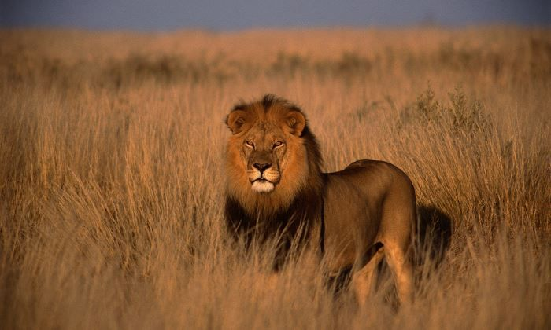

# Млекопитающие 🦁🐻

Млекопитающие — это особая группа [животныx](./животные.md), к которым относятся такие знакомые нам существа, как кошки, собаки, медведи и даже люди! 😺🐶👨‍👩‍👧‍👦

## Что такое млекопитающие?

Млекопитающие — это такие [животные](./животные.md), которые:

1. **Имеют волосы или шерсть** на своём теле. 🐾
2. **Рожают детёнышей**, а не откладывают яйца, как, например, [птицы](./птицы.md) или [рептилии](./рептилии.md). 👶
3. **Кормят своих детёнышей молоком**, которое они получают от мамы. Это и есть самое главное отличие от других животных! 🍼
4. **Дышат воздухом** (не живут в [воде](вода.md), как рыбы). 🌬️

## Примеры млекопитающих:

- 🦁 **Львы** — большие хищные кошки, которые живут в Африке.
- 🐻 **Медведи** — могут жить в лесах и даже в [горах](горы.md).
- 🐨 **Коалы** — маленькие млекопитающие, которые обитают в Австралии.
- 🦄 **Лошади** — домашние животные, которых люди используют для работы или катания.

## Почему млекопитающие такие особенные?

Млекопитающие отличаются от других [животных](./животные.md), например, от [рыб](./рыбы.md) или [рептилий](рептилии.md), потому что они могут учить своих малышей различным вещам. Мамы млекопитающих заботятся о своих детёнышах, кормят их молоком и защищают. 👩‍👧‍👦💕

## Где живут млекопитающие?

Млекопитающие могут жить почти везде! Они могут обитать в лесах 🌲, [горах](горы.md) 🏔️, а также в городах 🏙️ и на фермах 🚜.

## Заключение

Млекопитающие — это удивительные [животные](./животные.md), которые очень похожи на нас. Мы с ними имеем много общего! 😄

Так что в следующий раз, когда ты увидишь собаку 🐕 или кошку 🐈, ты будешь знать, что это млекопитающие! 🦁

