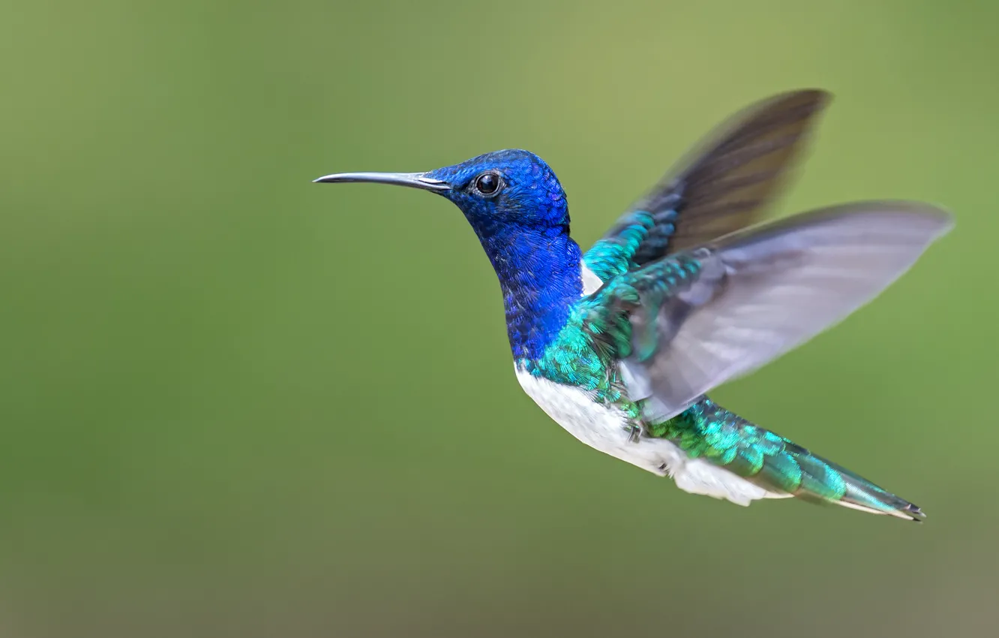

# 🦜 Птицы - удивительные животные! 🐦

Привет, друг! 👋 Сегодня мы узнаем про **птиц**! Ты когда-нибудь видел воробья или голубя? Это птицы! 🐦✨

## Что такое птицы? 🤔

Птицы — это особые **животные**. Да-да, они тоже животные, как кошки 🐱 и собаки 🐶, но у них есть **крылья** и **перья**! 

Вот что делает птиц особенными:

🦜 **Крылья** - помогают летать! Но не все птицы летают, например, пингвины 🐧.

🦜 **Перья** - покрывают тело, чтобы было тепло и красиво! 

🦜 **Клюв** - вместо зубов! Клювы бывают длинные, короткие, острые или широкие.

🦜 **Яйца** - птицы не рожают малышей, а откладывают яйца! 🥚

## Где живут птицы? 🌍

Птиц можно встретить **почти везде**: 

🌳 в лесу – совы 🦉 и дятлы 🐦,

🏙️ в городе – воробьи 🐦 и голуби 🕊️,

🌊 в воде – утки 🦆 и пеликаны 🦩.

## Чем питаются птицы? 🍽️

Птицы едят разную еду:

🌰 Орехи и семена – попугаи 🦜,

🦗 Насекомых – ласточки 🐦,

🐟 Рыбу – цапли 🦢,

🍇 Фрукты – туканы 🦜.

## Зачем нам птицы? 💡

Птицы **очень важны** для природы! Они помогают растениям 🌱 расти, переносят семена и ловят вредных насекомых. А ещё их пение делает утро добрым! 🎶

## Интересный факт! 🤩

Самая маленькая птичка – **колибри**! 🏆 Она меньше твоей ладошки и машет крыльями **очень быстро**!

---

Теперь ты знаешь, что птицы – это особенные животные, которые живут везде, едят разную еду и приносят пользу! В следующий раз, когда увидишь птицу, вспомни, какой она удивительный зверёк! 🦜😊

