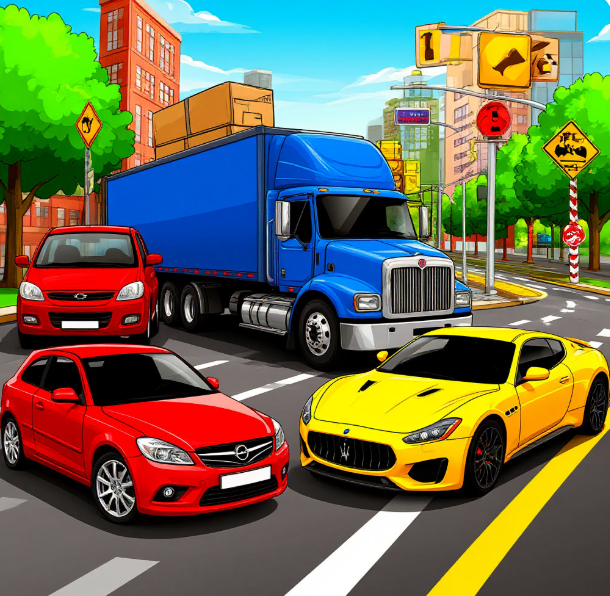
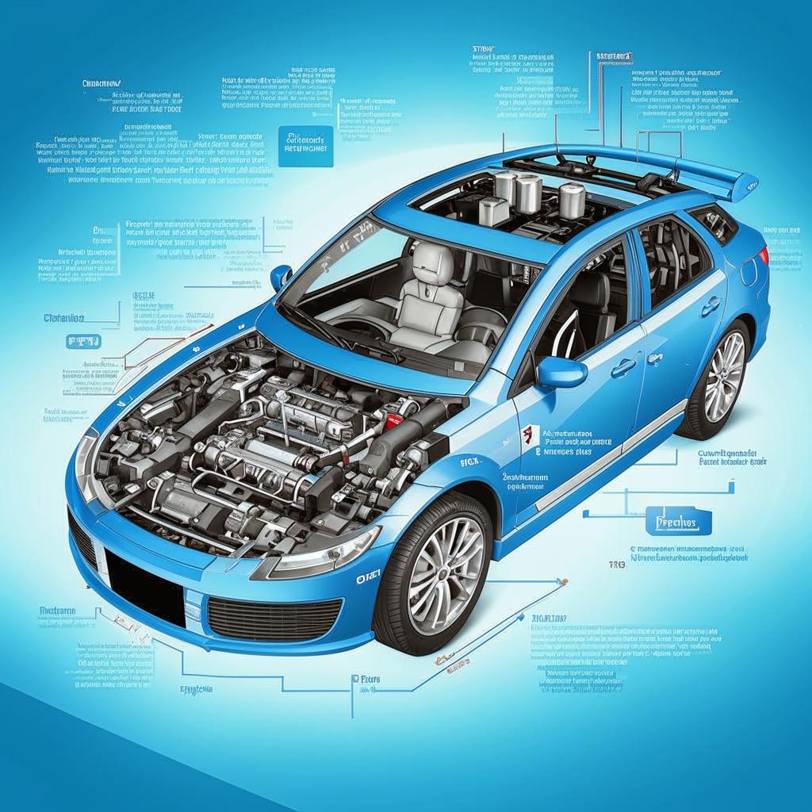
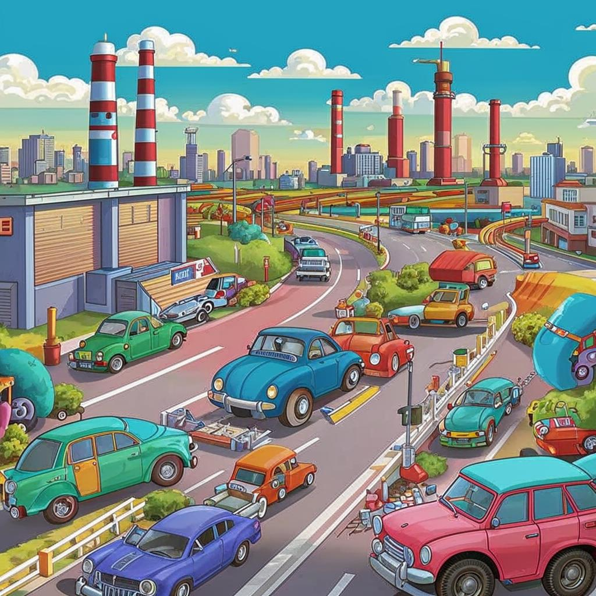

**Глава: Автомобиль**

🚗 **Введение**

Автомобиль — это транспортное средство, которое помогает людям перемещаться по дорогам. Он состоит из кузова, двигателя, колёс и множества других деталей. Автомобили бывают разных форм и размеров: от маленьких городских машин до больших грузовиков. Они могут быть как легковыми, так и грузовыми, и даже спортивными. 

🚗 **История**

Давным-давно, когда люди ещё не знали, что такое автомобиль, они передвигались на лошадях или пешком. Но в 1885 году немецкий инженер Карл Бенц создал первый автомобиль с двигателем внутреннего сгорания. Это был настоящий прорыв! До этого люди уже пробовали делать машины с [паровыми двигателями](Паровой_двигатель.md#паровой-двигатель), но они были слишком тяжёлыми и неудобными. 

Карл Бенц придумал, как сделать двигатель, который работает на бензине, и установил его на четырёхколёсную повозку. Так появился первый автомобиль, который мог ездить без помощи лошадей. Это изобретение стало началом новой эры в истории транспорта.

🚗 **Принципы работы**

Автомобиль работает благодаря двигателю, который преобразует энергию топлива (бензина или дизеля) в движение. Когда водитель нажимает на педаль газа, топливо поступает в двигатель, где оно смешивается с воздухом и воспламеняется. Это вызывает взрыв, который толкает поршни, а они, в свою очередь, вращают коленчатый вал. Коленчатый вал передаёт движение на колёса через трансмиссию, и автомобиль начинает двигаться.

Кроме двигателя, в автомобиле есть множество других важных систем. Например, тормоза помогают остановить машину, а рулевое управление позволяет менять направление движения. Также есть система охлаждения, которая предотвращает перегрев двигателя, и система смазки, которая защищает детали от износа.

🚗 **Влияние**

Автомобили изменили мир! Они сделали путешествия быстрее и удобнее. Раньше люди могли потратить несколько дней на дорогу, а теперь это занимает всего несколько часов. Автомобили также позволили людям жить дальше от работы и магазинов, что привело к развитию пригородов.

Кроме того, автомобили стали важной частью экономики. Они создают рабочие места на заводах, где их собирают, и в автосервисах, где их ремонтируют. Также они стимулируют развитие дорог и инфраструктуры.

🚗 **Интересный факт**

Знаете ли вы, что первый автомобиль Карла Бенца мог развивать скорость всего около 16 км/ч? Это примерно столько же, сколько может бежать человек! Но уже через несколько лет появились автомобили, которые могли разгоняться до 100 км/ч и даже больше. 

🚗 **Заключение**

Автомобили — это удивительные машины, которые изменили наш мир. Они делают нашу жизнь удобнее и быстрее. И хотя они могут быть сложными, их основные принципы работы можно понять даже ребёнку. 

Так что в следующий раз, когда вы будете ехать в машине, вспомните, как она работает и как она изменила мир вокруг нас! 🚗

