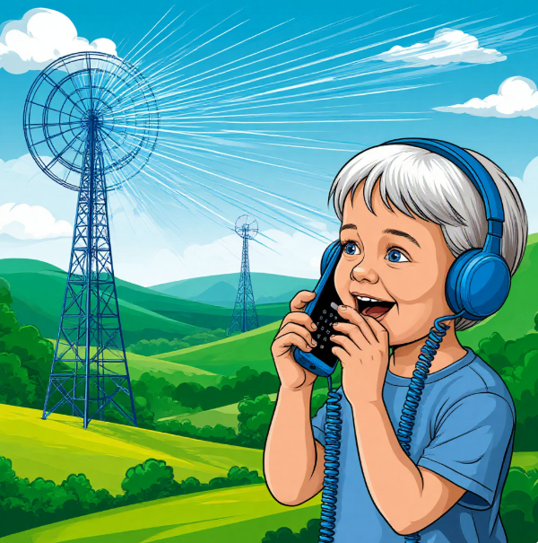

**Мобильный [телефон](Телефон.md#телефон): связь в твоем кармане!**

📱 **Введение**

Мобильный [телефон](Телефон.md#телефон) — это маленькое устройство, которое позволяет людям общаться друг с другом, находясь в разных местах. Он может звонить, отправлять сообщения, делать фотографии и даже играть в игры! Это как маленький компьютер, который всегда с тобой.

**История**

📱 **Как всё начиналось**

Давным-давно, когда люди только начинали мечтать о том, чтобы разговаривать друг с другом на расстоянии, они использовали телеграфы и первые [телефоны](Телефон.md#телефон). Но эти устройства были большими и тяжёлыми, и их нельзя было носить с собой. Всё изменилось в 1973 году, когда инженер Мартин Купер из компании Motorola сделал первый звонок с мобильного [телефона](Телефон.md#телефон). Этот [телефон](Телефон.md#телефон) был огромным и весил почти 1 кг! Представь себе, как тяжело было его носить!

📱 **Эволюция**

С тех пор мобильные [телефоны](Телефон.md#телефон) стали меньше и легче. В 1990-х годах появились первые модели, которые можно было носить в кармане. Они могли только звонить и отправлять сообщения. Но с развитием технологий [телефоны](Телефон.md#телефон) стали умнее. Появились смартфоны, которые могут делать всё: от просмотра видео до управления умным домом.

**Принципы работы**

📱 **Как это работает**

Мобильный [телефон](Телефон.md#телефон) использует радиоволны для связи. Когда ты говоришь в [телефон](Телефон.md#телефон), твой голос превращается в радиоволны, которые передаются на ближайшую вышку сотовой связи. Эта вышка отправляет сигнал на другую вышку, которая находится рядом с твоим собеседником. И вот, твой голос уже у него в [телефоне](Телефон.md#телефон)!

📱 **[Интернет](Интернет.md#интернет) и приложения**

Современные смартфоны также могут подключаться к [интернету](Интернет.md#интернет). Это позволяет тебе смотреть видео, играть в игры и общаться с друзьями через приложения, такие как WhatsApp или Instagram. Всё это возможно благодаря беспроводной связи и технологиям, которые позволяют передавать данные на большие расстояния.

**Влияние**

📱 **Как мобильные [телефоны](Телефон.md#телефон) изменили мир**

Мобильные [телефоны](Телефон.md#телефон) изменили нашу жизнь. Теперь мы можем общаться с друзьями и семьёй в любой точке мира. Мы можем работать, учиться и развлекаться, не выходя из дома. Мобильные [телефоны](Телефон.md#телефон) также помогают в экстренных ситуациях: если ты потерялся или попал в беду, ты всегда можешь позвонить за помощью.

📱 **Безопасность и здоровье**

Но, как и с любой технологией, важно помнить о безопасности. Не стоит пользоваться [телефоном](Телефон.md#телефон) во время вождения [автомобиля](Автомобиль.md#автомобиль) или в местах, где это может быть опасно. Также важно следить за временем, которое ты проводишь с [телефоном](Телефон.md#телефон), чтобы не перегружать глаза и мозг.

**Интересный факт**

📱 **Первый звонок с мобильного [телефона](Телефон.md#телефон)**

Знаешь ли ты, что первый звонок с мобильного [телефона](Телефон.md#телефон) был сделан Мартином Купером, инженером из компании Motorola, в 1973 году? Он позвонил своему конкуренту из компании Bell Labs и сказал: "Я звоню тебе с настоящего сотового [телефона](Телефон.md#телефон)". Это был исторический момент, который изменил мир связи навсегда!

📱 **Заключение**

Мобильные [телефоны](Телефон.md#телефон) — это удивительные устройства, которые сделали нашу жизнь проще и удобнее. Они позволяют нам оставаться на связи с близкими, работать и развлекаться в любое время и в любом месте. Но, как и с любой технологией, важно использовать их с умом и помнить о безопасности.