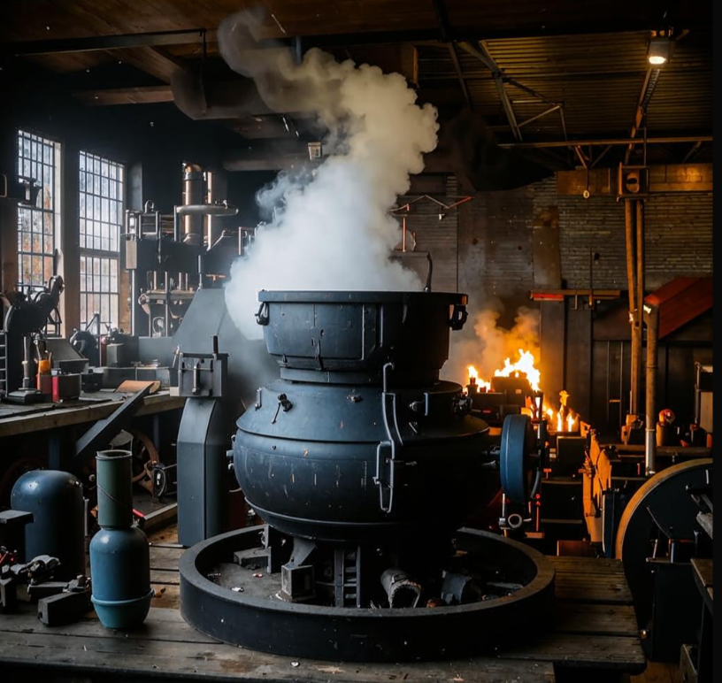
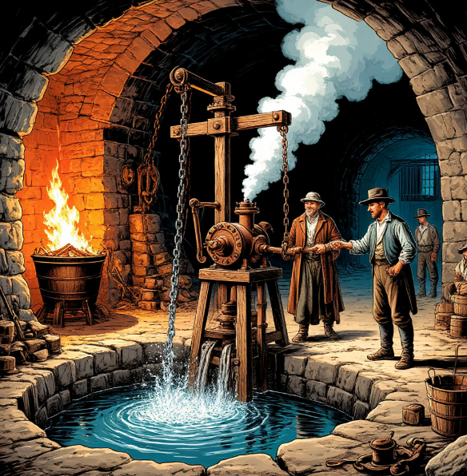
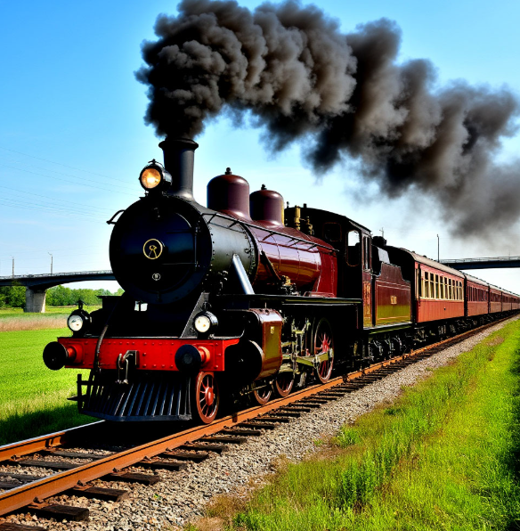

**Глава: Паровой двигатель**

💥 **Введение** 💥

Представь себе, что ты можешь заставить воду работать на тебя! Именно так и происходит в паровом двигателе. Это устройство превращает энергию пара в движение. Когда вода нагревается, она превращается в пар, который расширяется и толкает поршни или вращает колеса. Это движение можно использовать для самых разных целей, например, чтобы привести в действие машины, [поезда](Поезд.md#поезд) и даже корабли!

🔍 **История** 🔍

Давным-давно, в 1712 году, жил человек по имени Томас Ньюкомен. Он был инженером и очень хотел придумать способ, как поднимать воду из шахт. В то время шахты часто затапливались, и это было большой проблемой. Ньюкомен придумал паровой двигатель, который мог поднимать воду с помощью пара. Это был первый настоящий паровой двигатель!

Но самый известный паровой двигатель создал другой инженер, Джеймс Уатт. Он улучшил изобретение Ньюкомена и сделал его более эффективным. Благодаря Уатту паровые двигатели стали использоваться не только в шахтах, но и на [фабриках](Фабрика.md#фабрика), в [поездах](Поезд.md#поезд) и даже на кораблях. Это было начало промышленной революции!

🔧 **Принципы работы** 🔧

Теперь давай разберемся, как работает паровой двигатель. Представь себе котел, в котором кипит вода. Когда вода нагревается, она превращается в пар. Этот пар очень горячий и находится под большим давлением. Он направляется в цилиндр, где находится поршень. Пар толкает поршень, заставляя его двигаться. Это движение можно использовать для вращения колес или других механизмов.

Когда пар остывает, он снова превращается в воду и возвращается в котел. Этот процесс повторяется снова и снова, создавая непрерывное движение.

🌍 **Влияние** 🌍

Паровой двигатель изменил мир! Он помог людям производить больше товаров на [фабриках](Фабрика.md#фабрика), перевозить их на [поездах](Поезд.md#поезд) и кораблях. Благодаря этому товары стали доступнее и дешевле. Люди могли путешествовать быстрее и дальше. Это привело к развитию торговли и улучшению жизни людей.

Например, представь себе, что ты живешь в городе, где есть [фабрика](Фабрика.md#фабрика). Раньше товары производились вручную, и это занимало много времени. Но с появлением паровых двигателей [фабрики](Фабрика.md#фабрика) стали работать быстрее и эффективнее. Это значит, что ты можешь купить больше товаров по более низким ценам.

💡 **Интересный факт** 💡

Знаешь ли ты, что первый паровоз был создан в 1804 году? Он мог перевозить грузы и людей на небольшие расстояния. Но настоящий прорыв произошел в 1814 году, когда Джордж Стефенсон создал паровоз "Ракета". Этот паровоз мог развивать скорость до 48 км/ч! Это было невероятно быстро для того времени.

Так что, когда ты видишь [поезд](Поезд.md#поезд), помни, что его прародителем был паровой двигатель, который изменил мир! 🚄

Надеюсь, тебе было интересно узнать о паровом двигателе и его влиянии на нашу жизнь. Теперь ты знаешь, как работает это удивительное устройство и как оно помогло изменить мир!