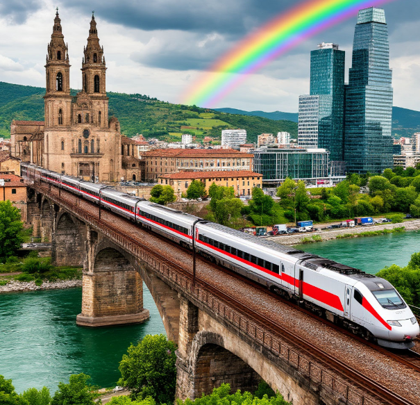

**Глава: Поезд**

🚆 **Введение**

Поезд — это транспортное средство, которое состоит из нескольких вагонов, соединённых между собой и движущихся по рельсам. Он может перевозить людей или грузы на большие расстояния. Поезда бывают разные: пассажирские, грузовые, скоростные и даже туристические. Они помогают нам путешествовать, перевозить товары и соединять города и страны.

🚂 **История**

Давным-давно, когда люди ещё не знали, что такое поезд, они использовали лошадей и повозки для передвижения. Но это было медленно и тяжело. В 18 веке, когда изобрели [паровой двигатель](Паровой_двигатель.md#паровой-двигатель), всё изменилось. В 1804 году британский инженер Ричард Тревитик создал первый паровоз, который мог тянуть вагоны по рельсам. Это был настоящий прорыв! Люди поняли, что поезд может быть быстрее и удобнее, чем лошади.

Со временем поезда стали всё более совершенными. Появились новые виды двигателей, такие как дизельные и электрические. Сегодня поезда могут развивать скорость до 300 км/ч и более! Это быстрее, чем многие [автомобили](Автомобиль.md#автомобиль).

🚄 **Принципы работы**

Поезд движется по рельсам благодаря специальным колёсам, которые имеют форму, позволяющую им не соскальзывать с рельсов. В начале поезда находится локомотив — это своего рода "мотор", который тянет за собой все вагоны. Локомотив может быть паровым, дизельным или электрическим.

- **[Паровой двигатель](Паровой_двигатель.md#паровой-двигатель)**: В таких локомотивах используется пар, который образуется при нагревании воды. Пар толкает поршни, которые приводят в движение колёса.
- **Дизельный двигатель**: Здесь используется дизельное топливо, которое сгорает и приводит в движение двигатель.
- **Электрический двигатель**: Такие поезда получают энергию от электрических проводов, которые висят над рельсами. Это самый экологичный и эффективный способ.

🚉 **Влияние**

Поезда сыграли огромную роль в развитии общества. Они помогли людям быстрее перемещаться между городами и странами, что способствовало торговле и обмену идеями. Благодаря поездам, товары могли доставляться на большие расстояния, что привело к росту экономики.

Сегодня поезда остаются важным видом транспорта. Они помогают нам путешествовать, а также перевозить грузы, такие как продукты, материалы и даже [автомобили](Автомобиль.md#автомобиль). В некоторых странах, например, в Японии и Франции, есть высокоскоростные поезда, которые могут развивать скорость до 300 км/ч и более. Это позволяет людям быстро добираться до работы или на отдых.

🚆 **Интересный факт**

Знаете ли вы, что самый длинный поезд в мире был длиной более 7 км и состоял из 682 вагонов? Он перевозил железную руду в Австралии. Это было настоящее инженерное чудо!

🚞 **Заключение**

Поезда — это удивительное изобретение, которое изменило мир. Они помогают нам путешествовать, перевозить грузы и соединять города и страны. Благодаря поездам, мы можем быстрее и удобнее перемещаться по миру. Так что в следующий раз, когда вы увидите поезд, вспомните, как много он значит для нашей жизни.