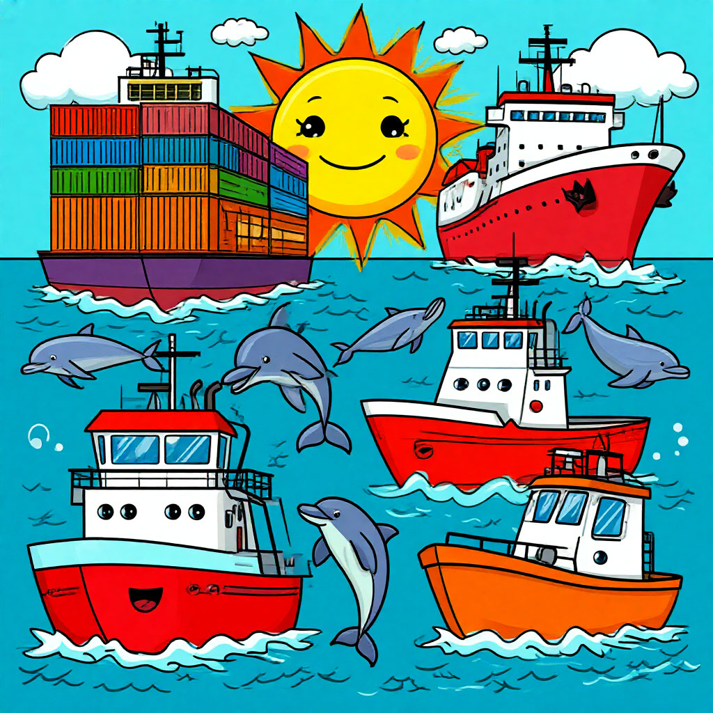
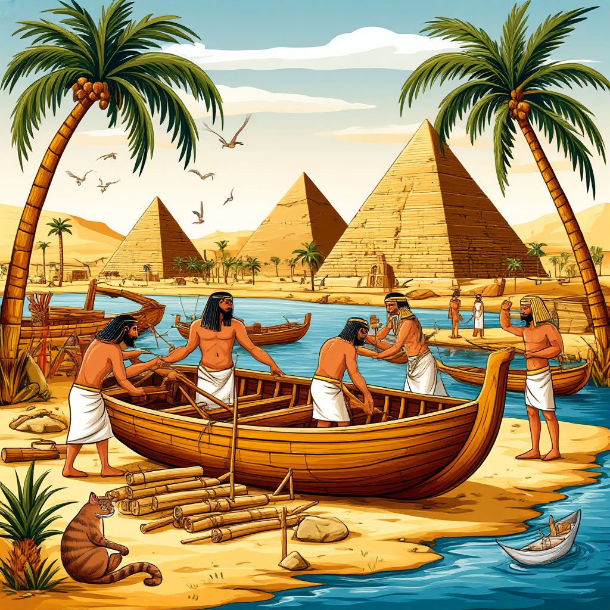
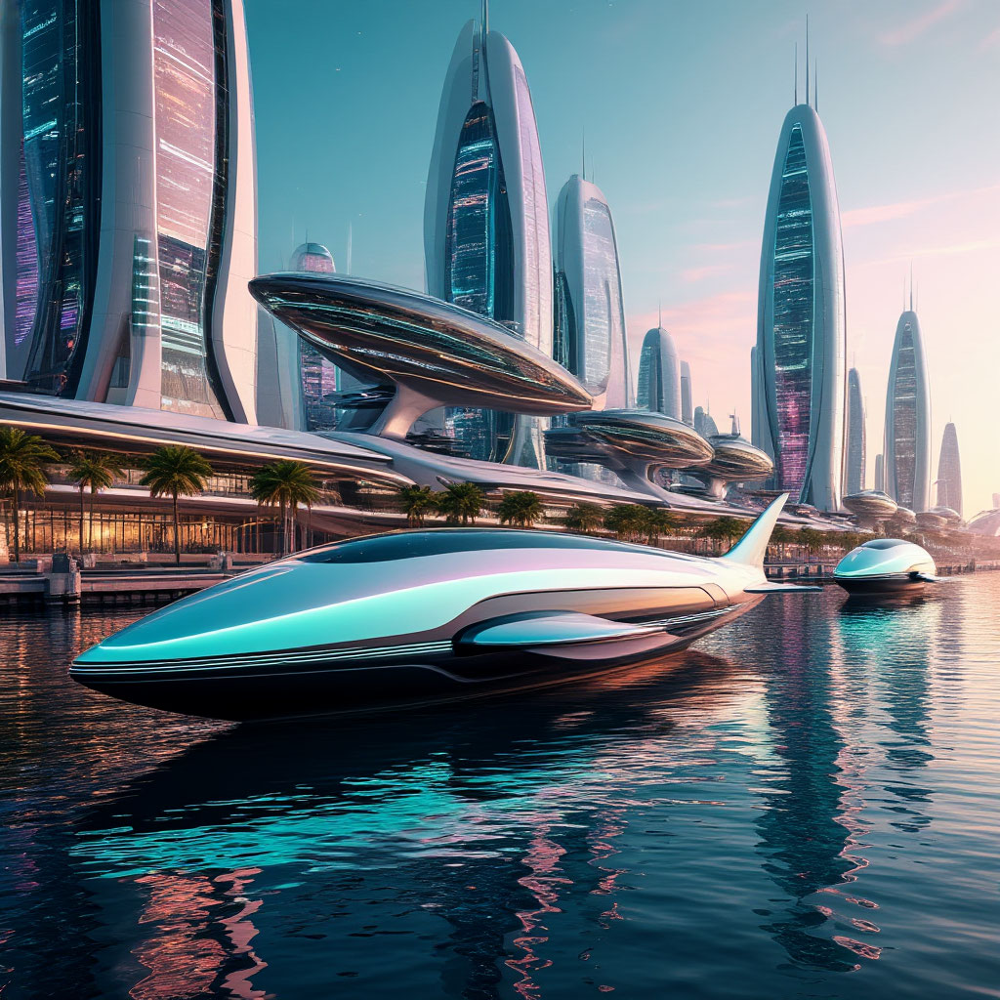

**Глава: Судно**

🌊 **Введение**

Судно — это плавательное средство, которое используется для передвижения по воде. Оно может быть разных размеров и форм, от маленьких лодок до огромных кораблей. Судно помогает людям путешествовать, перевозить грузы и исследовать моря и океаны. Представь себе, как здорово было бы отправиться в плавание на корабле и увидеть новые страны и острова!

🌈 **История**

Давным-давно, когда люди только начинали исследовать мир, они использовали простые плоты и лодки, сделанные из дерева. Эти первые суда были очень примитивными, но они уже позволяли людям пересекать реки и озера. Со временем люди научились строить более сложные и прочные корабли. В древности, например, финикийцы и египтяне строили большие парусные корабли, которые могли плавать по Средиземному морю. 

В Средние века появились каравеллы — легкие и маневренные корабли, на которых португальцы и испанцы отправлялись в дальние плавания, открывая новые земли. Одним из самых известных мореплавателей был Христофор Колумб, который в 1492 году на трех каравеллах — "Санта-Мария", "Пинта" и "Нинья" — отправился в плавание и открыл Америку.

🚢 **Принципы работы**

Судно держится на воде благодаря закону Архимеда. Этот закон гласит, что тело, погруженное в воду, выталкивается с силой, равной весу вытесненной воды. Это значит, что если судно вытесняет больше воды, чем весит само, оно будет плавать. 

Современные корабли могут быть оснащены различными двигателями. Например, на парусных судах движущей силой являются паруса, которые ловят ветер. На моторных судах используются двигатели, которые могут быть дизельными или электрическими. Эти двигатели вращают винты, которые толкают судно вперед.

🛳️ **Влияние**

Судна сыграли огромную роль в истории человечества. Они позволили людям исследовать новые земли, торговать с другими странами и даже завоевывать новые территории. Без кораблей не было бы великих географических открытий, таких как открытие Америки или кругосветное плавание Магеллана.

Сегодня суда продолжают играть важную роль в мировой экономике. Они перевозят огромное количество грузов, таких как нефть, зерно, [автомобили](Автомобиль.md#автомобиль) и даже контейнеры с товарами. Без судов было бы сложно представить себе современную торговлю и логистику.

🌟 **Интересный факт**

Знаешь ли ты, что самое большое судно в мире — это супертанкер "Knock Nevis"? Его длина составляет 458 метров, что больше, чем высота Эмпайр-стейт-билдинг в Нью-Йорке! Это судно было построено в 1979 году и использовалось для перевозки нефти. Оно было настолько большим, что не могло пройти через Суэцкий и Панамский каналы.

🚣‍♂️ **Заключение**

Судна — это удивительные плавательные средства, которые позволяют людям путешествовать и исследовать мир. Они сыграли важную роль в истории человечества и продолжают оставаться важными для современной экономики. Надеюсь, что эта глава помогла тебе лучше понять, как работают суда и какое влияние они оказывают на нашу жизнь. 

🌊🚢🛳️