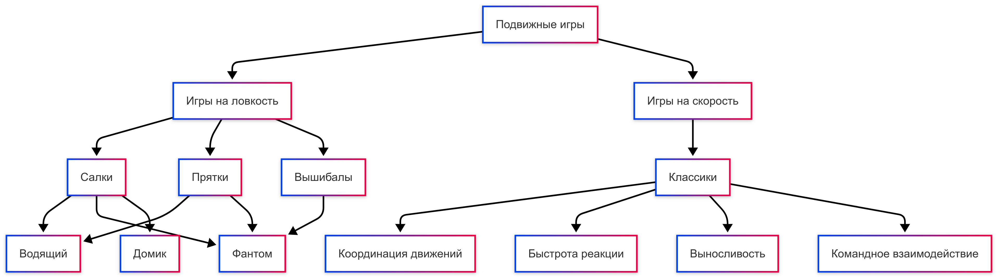

  
# Отчет по лабораторной работе

  

  

## Состав команды

  

  
  

| ФИО                                          | Что делал                                                    | Оценка |
|----------------------------------------------|--------------------------------------------------------------|--------|
| Бурганова Элина Ильнаровна М8О-303Б-22       | 4 термина, написание скрипта для перекрестных ссылок, написание отчета |        |
| Панкина Елизавета Дмитриевна М8О-306Б-22     | 4 термина, создание онтологии                                |        |
| Ажаурова Александра Константиновна М8О-303Б-22 | 4 термина, сбор информации                                   |        |
| Ахметшин Булат Рамилевич М8О-303Б-22        | 4 термина, создание списка используемых понятий              |        |

  

## Концептуализация предметной области

При создании книги для детей на тему подвижных игр с использованием ИИ, мы предварительно прошли несколько этапов концептуализации, чтобы определить основные темы, особенности стиля текста и иллюстраций.

Первоначально мы определили, что книга предназначена для детей возраста 10 лет. Наши основные цели были следующими:

- Создать увлекательный и доступный сюжет, который будет способствовать развитию воображения и активного интереса к подвижным играм.
- Использовать простую лексику и понятные образы, которые подойдут для детей указанной возрастной группы.

Мы уверены, что нам это удалось, так как книга получилась яркой, интересной и легкой для восприятия.

Затем мы изучили актуальные тренды в детской литературе, включая популярные жанры, героев и темы. Для сбора информации мы сначала обратились к `ChatGPT`, чтобы получить идеи, но в конечном итоге решили искать информацию вручную, используя ИИ как вспомогательный инструмент. Мы исследовали материалы, связанные с подвижными играми для детей, а также смотрели детскую литературу.

В процессе работы мы использовали различные инструменты, включая LLM (Large Language Model) – `ChatGPT`. Мы выбрали этот инструмент, потому что его возможности значительно превышают другие доступные варианты, например `YandexGPT`, который требует платной подписки.

Кроме LLM, мы использовали другие полезные инструменты, предложенные нашим преподавателем, такие как dbpedia, Mermaid.js. С помощью dbpedia мы узнали, какие данные существуют по теме подвижных игр, и поняли, что более надежно полагаться на LLM. Mermaid.js помог нам визуализировать зависимости между терминами:

В результате, мы создали интересную и познавательную книгу о подвижных играх с яркими и забавными иллюстрациями, которая будет полезна детям.

## Написание текстов

Все тексты в книге мы писали с помощью LLM в диалоговом окне. Мы использовали запросы вроде: `Напиши мне страницу в MD, как будто ты пишешь текст для десятилетнего ребенка`, и получали готовые страницы. После этого мы редактировали их, так как не всегда результат был полностью подходящим для наших целей. Мы добавляли изображения и сохраняли все в готовую книгу.

Одна из проблем заключалась в том, что LLM часто использовала слишком сложный язык, несмотря на наши промпты, такие как "пиши для детей". Кроме того, иногда предложенные картинки не совсем соответствовали контексту.

Для расставления ссылок мы использовали pethon-скрипт. Нам помогла встроенная библиотека Python, которая определяет падежи слов и позволяет автоматически вставлять ссылки в тексте. Например, выражение `подвижные игры` можно было преобразовать в ссылку `[подвижные игры](/path/to/file)`.

Для реализации этого процесса мы воспользовались библиотекой `pymorphy2`, которая помогает привести слова к их начальной форме.

## Выводы

В целом, мы довольны результатом, который мы получили. Книга получилась яркой, интересной и полезной. Мы уверены, что дети, которые будут читать ее, получат удовольствие и важные знания о подвижных играх.

Мы столкнулись с некоторыми трудностями, например, с поиском информации по теме, ведь подвижные игры — это обширная и многогранная тема. Тем не менее, мы уверены, что важность подвижных игр подчеркивает наша книга. Также стоит отметить, что иногда LLM не давала точного ответа, хотя мы пытались тщательно формулировать запросы. Мы часто вносили изменения вручную. Поэтому наша работа — это не только труд машины, но и важное участие человека в процессе.

В целом, LLM действительно упрощает некоторые процессы и помогает генерировать идеи, а также автоматизировать рутинные задачи, но человеческое вмешательство и взгляд остаются важными для достижения желаемого результата.
