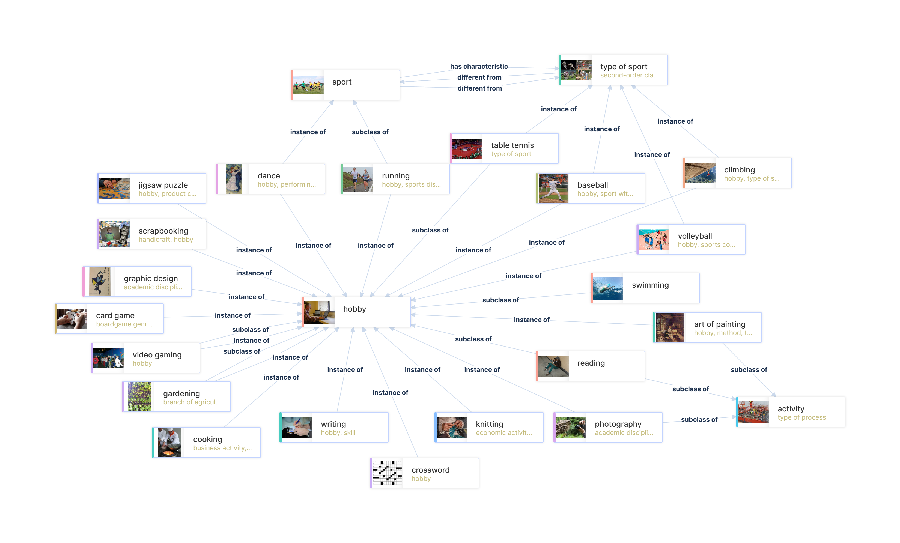
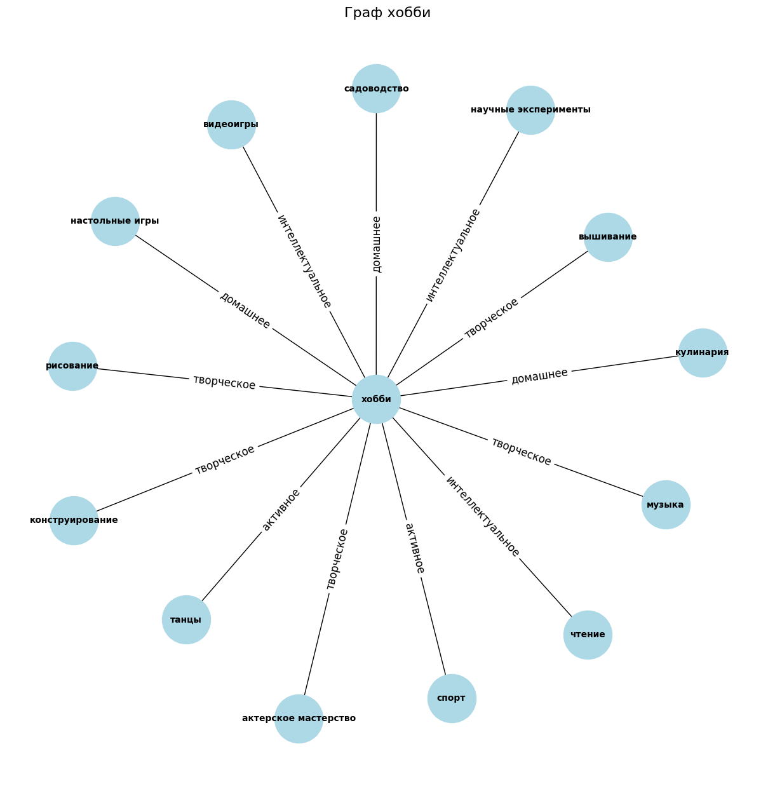
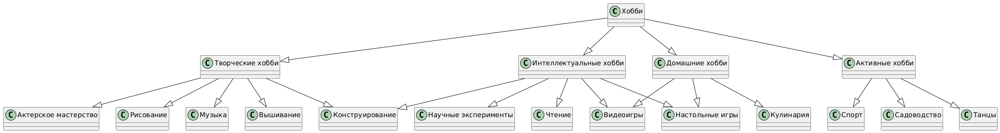

# Отчет по лабораторной работе

## Состав команды

| ФИО         | Что делал           | Оценка |
|-------------|----------------|--------|
| Былькова Кристина Алексеевна         | 6 терминов, генерация md файлов с использованием API GigaChat-2-Max, создание перекрестных ссылок, написание отчета |      |
| Немкова Анастасия Романовна         | 6 терминов, создание перекрестных ссылок, работа с запросами SPARQL, написание отчета | |
| Старостина Анна Андреевна         | 6 терминов, валидация сгенерированных файлов, генерация картинок jpeg, написание отчета  |  |

## Концептуализация предметной области

В процессе данной лабораторной работы наша команда занималась концептуализацией и построением онтологии предметной области **Хобби**.

Для начала мы зашли на **WikiData** и изучили существующие базы знаний по данной теме. Такой график мы увидели:



Однако здесь представлено огромное множество различных хобби. Мы решили выбрать определенные подклассы из **WikiData**, подходящие нам. Для извлечения подграфа знаний мы использовали **SPARQL** запросы: скрипт на Python с библиотекой ```SPARQLWrapper```. С помощью **SPARQL** запроса произвели фильтрацию всех объектов и отобразили на графе необходимые нам, выполнив разделение на 4 основных класса: творческие, интеллектуальные, активные и домашние хобби. 



Для более наглядного представления сущностей, мы составили граф онтологии с помощью PlantUML.



Таким образом, мы выявили следующие связи между классами:

- Основная страница - **Хобби**, связана с 4-мя основными направлениями: **творческие**, **интеллектуальные**, **активные** и **домашние** хобби;
- **Творческие** хобби подразделяются на рисование, музыку, актерское мастерство, конструирование, вышивание;
- **нтеллектуальные**: чтение, настольные игры, научные эксперименты, конструирование, видеоигры;
- **Активные**: спорт, танцы, садоводство;
- **Домашние**: настольные игры, кулинария, видеоигры.

## Написание текстов

Следующим этапом стало написание текстов для детской энциклопедии. Мы использовали скрипт на Python и получали markdown файлы с помощью API **GigaChat-2-Max**.

Здесь представлены сущности, для которых мы сгенерировали md файлы: 
```Python
CONCEPTS = [
    "Хобби", "Творческие", "Активные", "Интеллектуальные", "Домашние", 
    "Рисование", "Чтение", "Музыка", "Настольные игры", "Конструирование", 
    "Спорт", "Садоводство", "Научные эксперименты", "Кулинария", "Танцы", 
    "Вышивание", "Актерское мастерство", "Видеоигры" 
]
```

Также был написан промт, удовлетворяющий нашим требованиям. Данный промт отправлялся на вход LLM модели:
```
Представь, что ты тьютор. У тебя большой опыт в работе с детьми и широкий кругозор. Ты разбираешься во многих хобби. Твоя задача заключается в том, чтобы написать объемную, познавательную, понятную и развлекательную статью по конкретному понятию. При этом, необходимо, чтобы дети 10-ти лет заинтересовались и захотели узнать больше, попробовать себя в чём-то новом. Все термины, относящиеся к связанным понятиям пометь жирным шрифтом. Основные понятия:
        ["Хобби", "Творческие", "Активные", "Интеллектуальные", "Домашние", "Рисование", "Чтение", "Музыка", "Настольные игры", "Конструирование", "Спорт", "Садоводство", "Научные эксперименты", "Кулинария", "Танцы", "Вышивание", "Актерское мастерство", "Видеоигры"]. 
        Правила:
        - Результатом будет markdown страница;
        - Страница "Хобби" должна быть написана как основная и общая, сильно не вдаваясь в подробности каждого отдельного хобби: напиши пользу хобби в общем, зачем вообще заниматься хобби и т.п.;
        - Используй простые трендовые слова;
        - Добавляй много ЭМОДИ ЭМОДЗИ ЭМОДЗИ ИЛИ СМАЙЛИКИ СМАЙЛИКИ СМАЙЛИКИ;
        - Сначала дай определение
        - Приводи яркие примеры из жизни детей, которые будут раскрывать заданную тему: НЕ ДОБАВЛЯЙ В "ХОББИ";
        - Для всех терминов делай сноски с определениями;
        - Упомяни известных людей, которые преуспели в конкретном занятии: НЕ ДОБАВЛЯЙ В "ХОББИ";
        - Сделай сноски про положительные стороны каждого занятия и меры предосторожности: НЕ ДОБАВЛЯЙ В "ХОББИ";
        - Сделай небольшой вывод, который поможет запомнить материал;
        - Старайся делать структурированно.

        Понятие: {query}
```

После генерации нужных нам файлов, они были сохранены в отдельную папку ```concept```.

Далее необходимо было расставить ссылки между файлами - для более удобной навигации. Для данной задачи также был написан Python скрипт. Была использована библиотека ```pymorphy3```, производяющая морфологический анализ русских слов. Это было необходимо для расстановки ссылок у тех слов, которые написаны не в своей начальной форме. Также мы учли то, что ссылки не должны проставляться из файла в него же.

После мы приступили к генерации картинок в **GigaChat-2-Max** для визуализации основных понятий. Мы использовали данный промт:
```
Нарисуй понятную и красочную картинку: десятилетний ребенок {запрос, связанный с конкретным понятием}
```

## Выводы

В результате были успешно сгенерированы страницы для детской энциклопедии с помощью LLM модели. 

**Что применяли:**
- WikiData;
- SPARQL запросы;
- PlantUML;
- Python;
- GigaChat-2-Max.

**Что получилось:**
- Наглядные графы онтологии;
- Сгенерированные md страницы, написанные понятным для детей языком, с красочными изображениями;
- Настроенные ссылки между страничками.

**Сложности, с которыми мы столкнулись:** 
- Граф, получившийся на сайте **Wikidata**, огромен, что немного усложнило вычленение конкретных понятий и структурирования онтологии;
- Изначально выбрали другую модель **GigaChat**, которая генерировали markdown файлы, не полностью удовлетворяющие нашему запросу;
- Также столкнулись с проблемой генерации картинок: LLM модели испытывают некоторые сложности с генерацией людей - добавляются лишние пальцы или руки, искажаются пропорции. В итоге приходилось генерировать картинки несколько раз и писать более уточняющие промты. 

**Что можно улучшить:**
- Возможно добавить еще больше понятий для более полной энциклопедии;
- Можно взять более продвинутую и точную LLM модель для повышения качества текста.