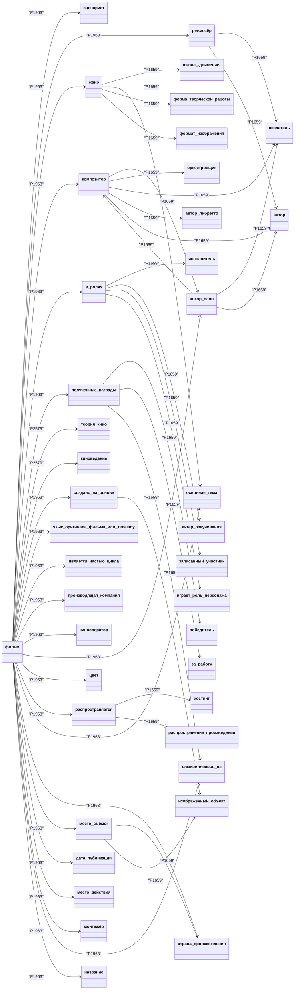

# Отчёт
## Онтология

```mermaid
classDiagram
  direction LR
  фильм --> сценарист : "P1963"
  фильм --> режиссёр : "P1963"
  фильм --> жанр : "P1963"
  режиссёр --> создатель : "P1659"
  фильм --> композитор : "P1963"
  фильм --> в_ролях : "P1963"
  фильм --> полученные_награды : "P1963"
  композитор --> автор_слов : "P1659"
  композитор --> оркестровщик : "P1659"
  фильм --> теория_кино : "P2579"
  фильм --> киноведение : "P2579"
  композитор --> создатель : "P1659"
  композитор --> автор_либретто : "P1659"
  композитор --> автор : "P1659"
  режиссёр --> автор : "P1659"
  жанр --> школа_-движение- : "P1659"
  фильм --> создано_на_основе : "P1963"
  фильм --> язык_оригинала_фильма_или_телешоу : "P1963"
  фильм --> является_частью_цикла : "P1963"
  в_ролях --> исполнитель : "P1659"
  фильм --> производящая_компания : "P1963"
  фильм --> кинооператор : "P1963"
  полученные_награды --> победитель : "P1659"
  фильм --> автор_слов : "P1963"
  полученные_награды --> за_работу : "P1659"
  жанр --> основная_тема : "P1659"
  автор_слов --> создатель : "P1659"
  фильм --> цвет : "P1963"
  фильм --> распространяется : "P1963"
  автор_слов --> композитор : "P1659"
  в_ролях --> актёр_озвучивания : "P1659"
  жанр --> форма_творческой_работы : "P1659"
  жанр --> формат_изображения : "P1659"
  фильм --> основная_тема : "P1963"
  фильм --> страна_происхождения : "P1963"
  распространяется --> хостинг : "P1659"
  распространяется --> распространение_произведения : "P1659"
  фильм --> место_съёмок : "P1963"
  фильм --> дата_публикации : "P1963"
  автор_слов --> автор : "P1659"
  фильм --> место_действия : "P1963"
  место_съёмок --> страна_происхождения : "P1659"
  фильм --> монтажёр : "P1963"
  полученные_награды --> номинирован-а-_на : "P1659"
  в_ролях --> записанный_участник : "P1659"
  фильм --> номинирован-а-_на : "P1963"
  создано_на_основе --> изображённый_объект : "P1659"
  фильм --> название : "P1963"
  место_съёмок --> изображённый_объект : "P1659"
  в_ролях --> играет_роль_персонажа : "P1659"
```