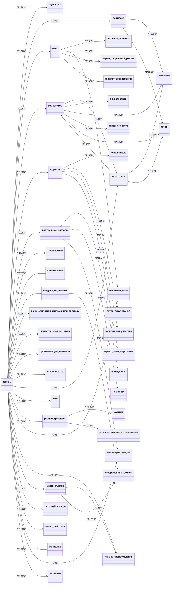

# Отчет по лабораторной работе

## Состав команды

| ФИО         | Что делал           | Оценка |
|-------------|----------------|--------|
| Епифанов Евгений Валерьевич | Работа со `SPARQL` |      |
| Салихов Тимур Русланович | Изучение предметной области, создание страниц |    |
| Эсмедляев Фёдор Романович | Формирование запросов, создание страниц |      |
| Головенко Анатолий Валерьевич | Взаимодействие с `LLM API Гигачат` |         |
| Куценко Максим Дмитриевич | Руководство, связывание кода и автоматизация генерации, отчётность |      |

## Концептуализация предметной области

Сначала мы изучили вручную что из себя представляет `Wikidata` и создали референсный граф с помощью `Wikidata Visualisation Tool`. Далее мы сначала написали простой запрос на `SPARQL`, потом поняли как создать граф и сформировали соответствующий запрос, выдающий результат в формате **id_объекта-название-определение-тип_связи-id_объекта-название-определение**, отфильтровали лишнюю информацию. После этого мы сделали обход графа начиная от его центра с формированием страниц.

Приложенный ноутбук ***автоматически*** создаёт для *указанного понятия* и *максимального числа связей* граф, отправляя `SPARQL`-запрос, формируя страницы со ссылками, concepts.json и онтологию в формате Mermaid.

Ниже указана онтология для *максимального числа связей* = 50.

## Написание текстов

Для формирования текста использовался `LLM API Гигачат`. Ему посылались типизированные запросы в следующем порядке:
- Формирование заголовка
- Формирование более развёрнутого определения (на основе информации из `Wikidata`)
- Формирование подзаголовка
- Объяснение связи понятия этой страницы и другого

В каждом запросе указывалось что текст предназначается для 10-летнего ребёнка, указывался объём текста, прикладывались определения и их описания.

К сожалению, т.к. нейронная сеть с трудом справлялась со сложными запросами, было принято решение вставлять ссылки на другие страницы в подзаголовки.

## Выводы

- В процессе использования Гигачата столкнулись с проблемой сертификации, но быстро её решили.
- Основной сложностью было получение хороших ответов от `Гигачата`. Изначально планировалось передать ему задачу по созданию места для вставки ссылки, но это оказалось безрезультатным. Был реализован функционал для изменения понятий, имеющих глаголы или находящихся не в именительном падеже, но нейронная сеть также с этим не справилась.
- Был реализован функционал по созданию `PlantUML`-диаграммы на основе графа из `SPARQL`, но потом было определено что `Github` поддерживает `Mermaid` и перешли к нему. 

В будущем можно реализовать анализ текста через `pymorphy2`, использовать более сложную нейронную сеть для повышения качества ответов, а также добавить создание изображений для страниц через соответствующую генеративную нейросеть.