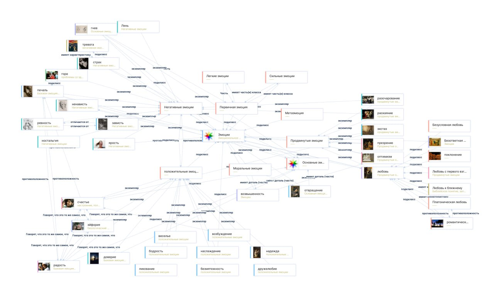
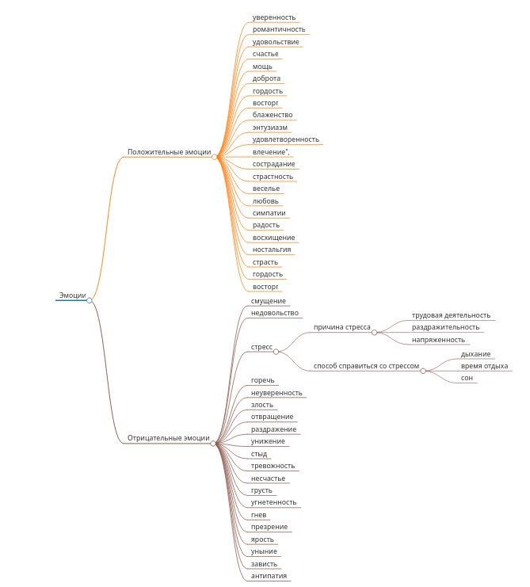
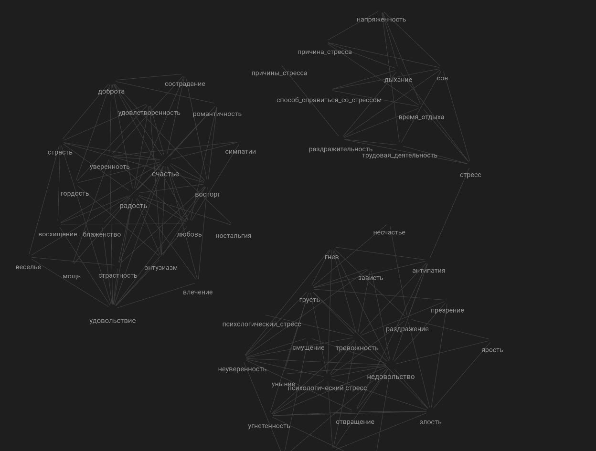

# Отчет по лабораторной работе

## Состав команды

| ФИО         | Что делал           | Оценка |
|-------------|----------------|--------|
| Болгаев А.А.         | Генерация текстов, составление SPARQL запросов |      |
| Даутов Т.Б.         | Генерация текстов, составление графов | |
| Каримов А.А.         | Генерация текстов, генерация картинок |  |
| Сектименко И.В.        | Генерация текстов, составление связей, составление SPARQL запросов для группировки понятий | |
| Волков А.Д.        | Генерация текстов, обработка SPARQL запросов (фильтрация результатов), отчет | |

## Концептуализация предметной области

Для начала, мы зашли на wikidata, чтобы посмотреть какие есть темы. Затем с помощью SPARQL-запроса мы смогли составить граф с темами, которые связаны с эмоциями.



SPARQL-запросы мы делали с помощью языка програмиирования `Python` с помощью библиотеки `SPARQLWrapper`.

SPARQL-запросом мы достали из wikidata подклассы (и их подклассы) эмоций. Посмотрев на получившийся граф, было принято решение его немного отфильтровать, а точнее взять все подклассы эмоций, которые содержат слово "эмоции". Так было получено деление эмоций на позитивные и негативные и примеры каждого класса эмоций.

Стресс - оказался частью негативных эмоций, что вполне логично. Из wikidata были получены причины стресса. Так же от себя были добавлены способы борьбы со стрессом.

По итогу, после того, как мы отфильтровали темы и разбили их на категории, мы приступуили к построению графа онтологии. Чтобы построить такой граф мы использовали инструмент `Markmap.js`. По итогу получился вот такой граф онтологии:



После построения графа онтологии мы занялись генерацией текстов.

## Написание текстов

Для генерации текстов мы написали программу на `Python`, которая обращается к API сервиса duck.ai, который в свою очередь обращается к модели `GPT4-o-mini`. Для того, чтобы сгенерировать текст для всех понятий, мы запустили цикл по всем понятиям из `concepts.json` и обращались к API сервиса duck.ai.

Чтобы удовлетворять условиям лабораторной работы, в запросах мы использовали промпт: `Объясни для десятилетнего ребенка понятие <понятие>`. Таким образом тексты были написаны простым и понятным языком. Также, мы использовали еще один промпт, для того чтобы GPT сам связывал понятия, которые мы ему даем: `если понятие имеет связь с другими, то сделай на них ссылку в формате гиперссылки markdown [понятие](понятие.md)`. Из-за этого нам не надо было вручную придумывать и расставлять ссылки в текстах, достаточно было лишь исправить некоторые из-них, чтобы переходы по ссылкам срабатывали конкретно.

По итогу, `GPT` связала понятия подобным образом:



Как видно из графа `Obsidian`, темы четко разделились на категории негативных эмоций и позитивных эмоций. Также видно группу тем связанных со стрессом. Если посмотреть на наш граф онтологии, то так и должно было получиться.

Также мы использовали еще несколько промптов, для того чтобы модель писала текст по шаблону и добавляла туда соответствующиие эмодзи, чтобы добавить красочности в нашу энциклопедию. Итоговый промпт выглядит подобным образом:
```
Вот тебе список всех понятий {concepts}, связанных со стрессом. 
    Объясни максимально подробно для десятилетнего ребенка что такое {concept} на русском языке. 
    Приведи примеры ситуаций, когда десятилетний ребенок может испытать данную эмоцию.
    Пиши текст с такой структурой:
    - определение
    - примеры
    - способы решения
    - заключение
    Оформи каждый пункт выдели и добавь соответсвующие эмодзи.
    По возможности для объяснения понятия ссылайся на другие понятия из списка.

    Расставь ссылки на другие понятия из списка в формате гиперссылки markdown [понятие](понятие.md).
```
Также мы решили для каждого понятия сгенерировать по картинке с помощью программы на `Python`, которая обращается к API модели `GigaChat`. Аналогично генерации текстов, мы сгенерировали картинки для каждого понятия. Затем написали скрипт, который будет вставлять картинки в соответствующие markdown-файлы. По итогу получилась красочная детская энциклопедия.

## Выводы

Самая сложная работа заключалась в построении графа онтологии и в фильтрации результатов SPARQL-запросов. С графом онтологии получилось разобраться с помощью `Markmap.js`, трудности возникли с тем, что понятий оказалось слишком много и приходилось сужать граф, чтобы было все видно. Также возниколи трудности с генерацией картинок, приходилось делать несколько попыток для получения желаемого результата.

В будущем, можно улучшить навигацию, так как тем слишком много, сейчас сложно по ним перемещаться в поисках какой-то конкретной темы. Для этого можно ввести еще несколько категорий.

Нам понравилась наша энциклопедия, так как она получилась красочной и интересной. Детям будет интересно и увлекательно ее читать и каждый день узнавать что-то новое. 