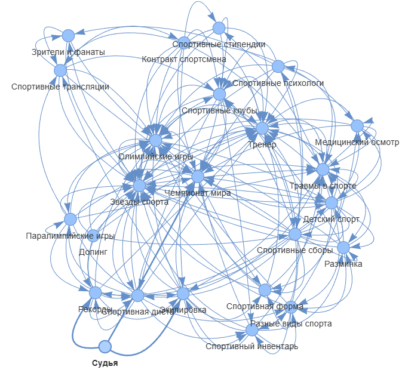
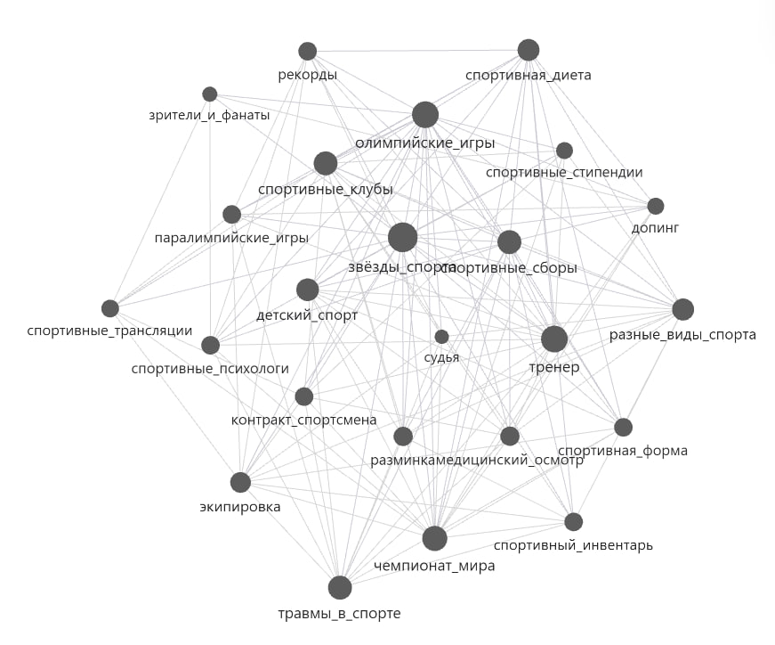

# Отчет по лабораторной работе

## Раздел - Профессиональный спорт

## Состав команды

| ФИО         | Что делал           | Оценка |
|-------------|----------------|--------|
| Бычков Артур Сергеевич         | Реализация понятий 1-8 |      |
| Климов Иван Павлович         | Реализация понятий 9-14; Написание отчета | |
| Лебедько Платон Владимирович         | Реализация понятий 17-22; Написание отчета |  |
| Баталин Дмитрий Андреевич         | Реализация понятий 15, 16, 23, 24; Реализация скриптов для визуализации онтологии | |

## Концептуализация предметной области

Концептуализацию предметной области проводили силами LLM. Для выделения понятий использовался следующий промпт:
```
Я создаю детскую энциклопедию. Направление - здоровье, раздел - Профессиональный спорт. Придумай 24 понятия, относящиеся к моему разделу, к каждому из которых я потом буду отдельную статью.
Учитывай, что моя энциклопедия должна быть понятна для десятилетнего ребенка.
```

Был принят следующий список понятий:
- 1 Тренер – Кто такой и зачем он нужен спортсменам.
- 2 Разминка – Почему перед тренировкой важно разогреваться.
- 3 Спортивная форма – Что это и почему без неё нельзя выступать.
- 4 Олимпийские игры – Самое главное спортивное событие в мире.
- 5 Чемпионат мира – Как спортсмены борются за звание лучших.
- 6 Медицинский осмотр – Почему спортсмены постоянно проверяют здоровье.
- 7 Допинг – Почему запрещён и чем опасен.
- 8 Спортивная диета – Что едят чемпионы, чтобы быть сильными.
- 9 Травмы в спорте – Как их избежать и что делать, если получил.
- 10 Разные виды спорта – Чем отличаются командные и индивидуальные.
- 11 Спортивный инвентарь – Какие бывают мячи, ракетки, клюшки и т. д.
- 12 Судья – Кто следит за правилами в спорте.
- 13 Рекорды – Как люди становятся самыми быстрыми, сильными и ловкими.
- 14 Спортивные клубы – Где тренируются профессионалы.
- 15 Зрители и фанаты – Как болельщики поддерживают спортсменов.
- 16 Спортивные стипендии – Как спорт помогает учиться в университетах.
- 17 Паралимпийские игры – Спорт без границ: истории спортсменов с инвалидностью.
- 18 Детский спорт – С какого возраста можно стать профессионалом.
- 19 Спортивные сборы – Зачем спортсмены уезжают на тренировки в другие города.
- 20 Контракт спортсмена – Как зарабатывают профессиональные атлеты.
- 21 Спортивные трансляции – Как снимают соревнования для телевидения.
- 22 Экипировка – Почему лыжники, хоккеисты и футболисты носят разную форму.
- 23 Спортивные психологи – Кто помогает спортсменам не бояться поражений.
- 24 Звёзды спорта – Истории известных чемпионов и их путь к успеху

## Написание текстов

Написание текстов проводили вручную с помощью LLM, попутно попросив проставлять ссылки на связанные понятия сразу - чтобы не пришлось делать это самому программно. Статьи генерировали таким промптом:
```
Привет! Я создаю детскую энциклопедию. Направление - здоровье, раздел - Профессиональный спорт. В моем разделе есть 24 понятия:
1 Тренер – Кто такой и зачем он нужен спортсменам.
...
24 Звёзды спорта – Истории известных чемпионов и их путь к успеху

Напиши небольшую статью в формате Markdown, раскрывающую такое понятие. Объясняй как десятилетнему ребенку, используй возможности Markdown, вставляй смайлики, если это необходимо.
В статье должны быть ссылки на другие понятия из моего раздела. При упоминании другого понятия вставляй кликабельную ссылку на его файл. Каждое понятие будет хранится в файле название_понятие_в_таком_формате.md.
```

## Визуализация полученных связей

Так как реализация связей между статьями была отдана на усмотрение LLM, было интересно посмотреть, какие связи получились в итоге. Для этого был написан скрипт на python, визуализирующий граф связей.

На первой итерации скрипта, граф сохранялся в формате .png, что получилось неудобно, так как связей достаточно много - 162 штуки. Затем была использована библиотека `plotly`, позволяющая масштабировать полученный граф. Конечным результатом скрипта стало использование библиотеки `pyvis`, позволяющей строить граф подобно графу в самом Obsidian, с физикой вершин и перетаскиваением. Результат находится в файле `pyvis_graph.html`.

Результат с `pyvis`:


Результат в Obsidian:


## Выводы

Нам удалось сделать набор статей для детской энкциклопедии по теме "Профессиональный спорт". Мы правильно составили промпты, чтобы статьи излагались структурированно, детским языком, а также связывались друг с другом.

Проблема, с которой мы столкнулись - сложность отслеживания полученных связей. Связей между статьями получилось довольно много, поэтому визуализация графа связей получилась слишком нагруженной и не слишком эффективной для анализа набора наших статей. Однако, эту проблему можно решить, если более тонко настроить наше решение по визуализации с `pyvis`, добавив настройки по физичности вершин.