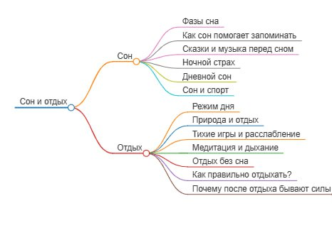

# Отчет по лабораторной работе

## Состав команды

| ФИО           | Что делал                                                                    | Оценка |
| :------------ | ---------------------------------------------------------------------------- | ------ |
| Седов М.А.    | Генерация текстов, составление связей                                        |        |
| Ларченко А.О. | Генерация текстов, составление графов                                        |        |
| Бурунов М.А.  | Генерация текстов, отчёт                                                     |        |
| Кочев Д.В.    | Генерация текстов, составление связей, помощь в группировке понятий          |        |
| Свиридов С.Ю. | Генерация текстов, обработка SPARQL запросов (фильтрация результатов), схемы |        |

## Концептуализация предметной области

При создании детской энциклопедии с использованием ИИ мы разработали несколько этапов концептуализации предметной области. Это помогло нам определить ключевые темы, целевую аудиторию и стиль изложения текста и иллюстраций.

### Определение целевой аудитории и целей

С самого начала мы решили, что энциклопедия предназначена для детей младшего школьного возраста (6–9 лет). Наши основные цели:

- Сделать текст увлекательным и понятным, чтобы он развивал воображение и любознательность.
- Использовать простую лексику и доступные образы, соответствующие возрасту читателей.

Мы считаем, что достигли этих целей, так как текст получился лёгким для восприятия, а иллюстрации — яркими и привлекательными.

### Анализ современных тенденций

Мы изучили современные тенденции в детской литературе, включая популярные жанры, персонажей и темы. Вначале мы обратились к ChatGPT за анализом, но позже решили провести собственное исследование. Мы искали примеры детской литературы на тему сна и отдыха, анализировали презентации для младших школьников и изучали уже успешные книги, написанные простым языком.

### Использованные инструменты

В работе мы использовали различные инструменты:

- **LLM (ChatGPT)** — мы выбрали его как одну из самых передовых моделей, поскольку аналоги вроде YandexGPT требуют платной подписки, а DeepSeek часто перегружен.
    
- **Инструменты, предложенные преподавателем:**
    
    - **DBpedia** — помогла понять, какие данные уже существуют по нашей теме, но в итоге мы решили довериться LLM.
        
    - **PlantUML** — использовался для визуализации зависимостей между терминами, но итоговый результат оказался слишком громоздким, поэтому мы решили перерисовать схему вручную.
        
    - **Wikidata Visualization** — позволил изучить взаимосвязи между понятиями и уточнить структуру книги.

Таким образом, мы прошли путь от первоначального анализа до визуализации ключевых понятий, опираясь как на ИИ, так и на собственное исследование.

Мы решили выбрать определенные подклассы из **WikiData**, подходящие нам. Для извлечения подграфа знаний мы использовали **SPARQL** запросы: скрипт на Python с библиотекой `SPARQLWrapper`. С помощью **SPARQL** запроса произвели фильтрацию всех объектов и отобразили на графе необходимые нам, выполнив разделение на 2 основных класса: Сон и отдых.

После построения графа онтологии мы занялись генерацией текстов.

## Написание текстов

Весь текст этой книги создавался с помощью LLM в диалоговом окне. Мы давали запрос: *"Напиши мне страницу в MD, будто ты пишешь страницу книжки для маленького ребенка"*, а затем получали содержимое MD-файла. После этого мы редактировали текст, так как полностью желаемого результата достичь не удавалось, добавляли картинки и сохраняли материал в книге.

Была небольшая проблема: LLM часто писала слишком сложным языком, даже если мы просили использовать упрощённый стиль. Также предлагались изображения, которые не всегда соответствовали контексту.

Ссылки в тексте мы расставляли с помощью специального скрипта, написанного одним из участников команды. Он использовал встроенные библиотеки Python, умеющие определять падеж слов и менять их по принципу ссылок в MD. Например, строка "*ночные страхи*" автоматически преобразовывалась в "*ночной страх*". Для этого нам помогла библиотека pymorphy3, которая позволяет приводить слова к нормальной форме.

## Выводы

Процесс создания этой книги был увлекательным и по-настоящему творческим. Мы довольны результатом: книга получилась не только красивой, но и полезной. В ней простым и доступным языком объясняются важные вещи, которые помогут детям лучше понять свои страхи и научиться с ними справляться. Мы надеемся, что чтение этой книги будет не только познавательным, но и увлекательным для малышей.

Однако работа над книгой не обошлась без сложностей. Тема ночных страхов оказалась одновременно интересной и непростой. Мы хотели объяснить её так, чтобы ребёнок мог не только понять, но и применить полученные знания в жизни. Поиск информации потребовал от нас внимательности и тщательной проверки источников. Хотя LLM значительно упростила процесс, предоставляя нам основу для текста, полученные результаты не всегда соответствовали нашим ожиданиям. Нам приходилось многократно редактировать материалы, адаптировать язык и подбирать примеры, чтобы сделать книгу понятной и доступной для маленьких читателей.

Этот проект показал, что LLM — это мощный инструмент, который может облегчить работу, подсказать идеи и автоматизировать рутинные процессы. Однако без участия человека, его опыта, знаний и творческого подхода невозможно создать действительно качественный и гармоничный текст. Именно благодаря усилиям нашей команды книга приобрела свой окончательный вид, стала живой и интересной. Мы гордимся проделанной работой и надеемся, что наша книга принесёт пользу многим детям и их родителям.