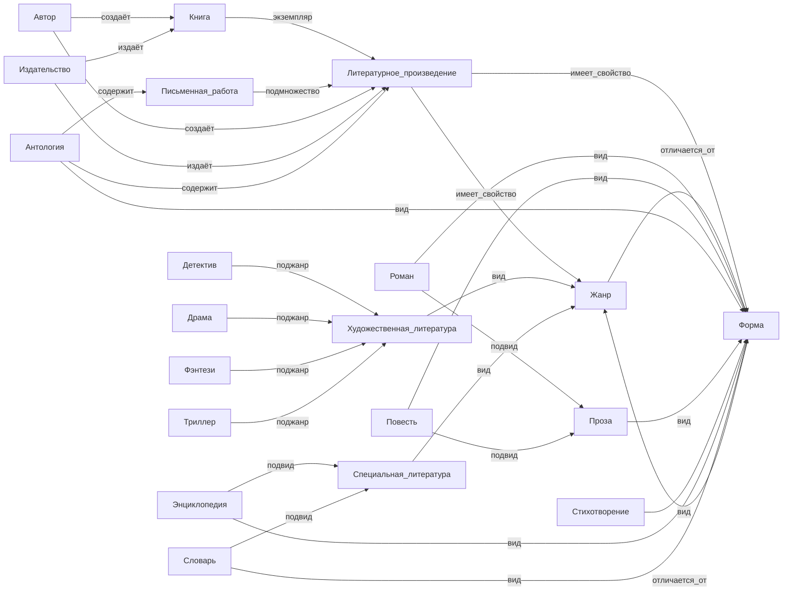

# Отчет по лабораторной работе

## Состав команды

| ФИО         | Что делал           | Оценка |
|-------------|----------------|--------|
| ...         | ... |      |
| ...         | ... | |
| ...         | ... |  |
| ...         | ... | |

## Концептуализация предметной области

Как проводили концептуализацию предметной области, какие инструменты использовали, графики, результаты...

## Написание текстов

Как проводили написание текстов, использовали ли LLM API программно или делали вручную, какие промпты использовали, как расставляли ссылки в тексте...

## Выводы

С какими сложностями столкнулись, какие решения применили, что получилось, что нет, что можно улучшить, ...