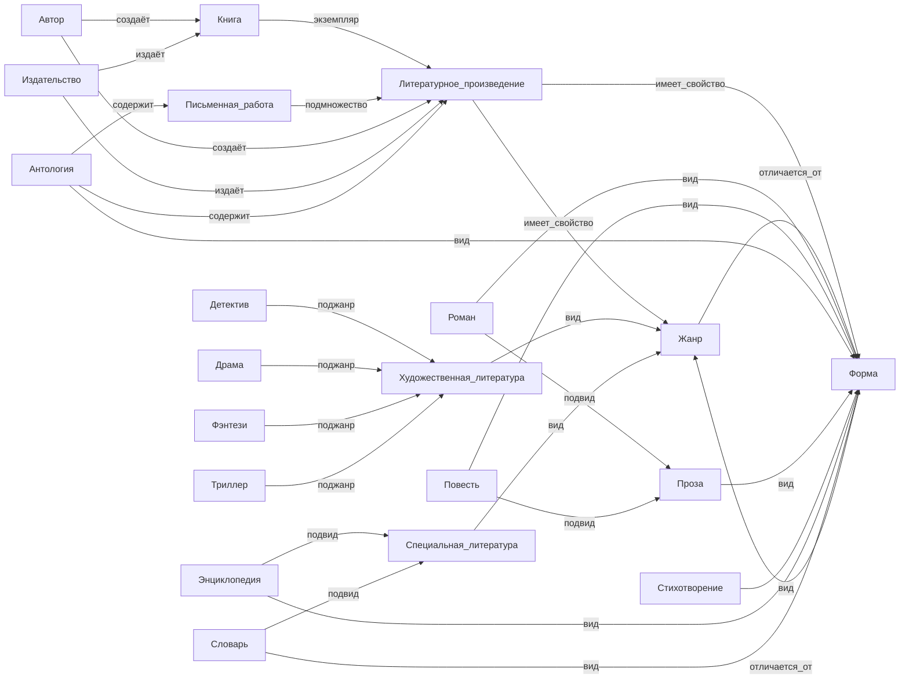

# Отчет по лабораторной работе

## Состав команды

| ФИО         |     Что делал             |Оценка |
|-------------|------------------|--------| 
| Мудров Павел Федорович        | Написание отчета, координация и управление командой | |
| Коваленко Александр Игоревич   | Генерации понятий с использованием LLM| |
| Бачурин Павел Дмитриевич          | Написание python-скриптов для растановки перекрестных ссылок  | |
| Шипилов Кирилл Юрьевич         | sparql-запросы, извлекал фрагменты знаний и строил графы.|  | 
|Теребаев Кирилл Дмитриевич       |sparql-запросы, выделял основные концепты и определял их связи, используя свойства Wikidata|  |

## Написание текстов

Весь текст генерировался при помощи LLM API от GigaChat. Использовали модель GigaChat-Max.  Мы написали скрипт, который работает следующим образом: пользователь вводит название термина, далее скрипт отправляет запрос к GigaChat-Max, используя заранее подготовленный промпт:
"Объясни понятие '{concept}' для десятилетнего ребенка". Напиши текст в формате Markdown, который включает заголовок и доступное объяснение."

## Концептуализация предметной области детской книги

При создании детской книги с помощью ИИ мы определили следующие ключевые понятия и взаимосвязи:

## Ключевые понятия и связи

Книга является экземпляром Литературного произведения, которое характеризуется такими свойствами, как Жанр и Форма.

Автор создаёт Книгу и непосредственно само Литературное произведение.

Издательство занимается изданием Книг и Литературных произведений.

## Жанры и виды

Жанр отличается от понятия Форма, и оба являются характеристиками литературных произведений.

## Примерами жанров являются:

Художественная литература, включающая поджанры: Детектив, Драма, Фэнтези, Триллер.

Специальная литература, представленная такими видами, как Энциклопедия и Словарь.

### Формы и их разновидности

## Формы литературных произведений включают:

### Проза (например, Роман, Повесть).

### Стихотворение.

### Антология, которая может содержать как Литературные произведения, так и Письменные работы.

## Итоговый подход

Использование структурированной концептуальной схемы позволило ясно определить роли и отношения между элементами книги, что обеспечивает систематизацию информации и облегчает её восприятие детской аудиторией.
## Выводы
В рамках данной лабораторной работы мы убедились в высокой обобщающей способности LLM (Large Language Models), а также в её важном свойстве — умении объяснять сложные абстрактные понятия детям доступным языком, с использованием различных примеров, проецированных на понятную, уменьшенную размерность.
Мы применяли Python-скрипты для автоматизации запросов, строили SPARQL-запросы для объединения связей в заданной предметной области, а также работали с mermaid-диаграммами для визуализации онтологических связей между понятиями.

Данный опыт показал, что использование ИИ в образовательных целях открывает широкие возможности для создания обучающего контента, адаптированного под возраст и уровень подготовки аудитории. Особую ценность представляет возможность наглядного представления данных, что усиливает вовлечённость и понимание материала детьми.