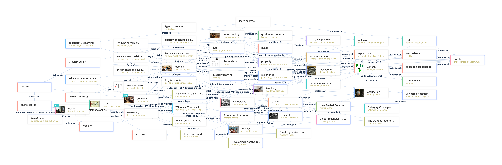
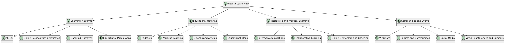

# Отчёт по лабораторной работе

## Состав команды

| Участник         | Задачи           | Оценка |
|------------------|--------------------------|--------|
| Николай Цирулев  | Создание markdown страниц, создание перекрёстных ссылок, написание отчёта | |
| Кирилл Слетюрин  | Создание markdown страниц, создание перекрёстных ссылок | |
| Серафим Шелаев   | Генерация изображений с использованием LLM, написание отчёта  | |
| Владимир Марков  | Поиск знаний из структурированных источников, создание онтологии, написание отчёта  | |
| Данил Зиновьев   | Поиск знаний из структурированных источников, создание онтологии, написание отчёта |  |

## Концептуализация предметной области

В рамках этой лабораторной работы мы занимались концептуализацией и построением онтологии области **Как узнавать новое онлайн**.

Сначала мы исследовали WikiData по нашей теме. Используя инструменты визуализации графов знаний (Wikidata Query Service), мы создали следующий граф:



Анализируя его, мы выявили ключевые понятия и составили граф онтологии с помощью PlantUML:



Мы выделили следующие связи между классами:
- **Как узнавать новое Онлайн**
  - **Платформы для обучения**
    - Массовые открытые онлайн-курсы (MOOC)
    - Онлайн-курсы с сертификатами
    - Геймифицированные платформы
    - Образовательные мобильные приложения
  - **Образовательные материалы**
    - Подкасты
    - Обучение через YouTube
    - Электронные книги и статьи
    - Образовательные блоги
  - **Интерактивное и практическое обучение**
    - Интерактивные симуляции
    - Совместное обучение
    - Онлайн-наставничество и коучинг
  - **Сообщества и мероприятия**
    - Вебинары
    - Форумы и сообщества
    - Социальные сети
    - Виртуальные конференции и саммиты

## Написание текстов

Для создания текстов был разработан Python-скрипт, который генерирует markdown файлы с использованием API GigaChat-2-Max. В скрипте используются библиотеки для работы с файлами и шаблонами, такие как os и pathlib. Скрипт автоматизирует процесс создания файлов на основе заданных концептов. 
Мы использовали следующий промт для генерации текстов:
```
        Представь, что ты опытный педагог и писатель, создающий детскую энциклопедию о способах изучения нового онлайн. Твоя задача – написать захватывающую, познавательную и понятную статью по заданной теме. Учитывай, что читатели – любознательные дети 8-12 лет, которым важно объяснить сложные вещи простым и увлекательным языком. Основные понятия:
        Как узнавать новое Онлайн, 
        Обучающие платформы,
        Учебные материалы,
        Интерактивное и практическое обучение,
        Сообщества и мероприятия,
        Массовые открытые онлайн-курсы (MOOC), Онлайн-курсы с сертификатами, Геймифицированные платформы, 
        Образовательные мобильные приложения, Подкасты, Обучение через YouTube, Электронные книги и статьи, 
        Образовательные блоги, Интерактивные симуляции, Совместное обучение, Онлайн-наставничество и коучинг, 
        Вебинары, Форумы и сообщества, Социальные сети, Виртуальные конференции и саммиты.
        Структура статьи:
        1. **Заголовок** – яркий и привлекающий внимание.
        2. **Введение** – краткое и интересное объяснение, почему этот способ обучения полезен.
        3. **Что это такое?** – определение понятия простыми словами.
        4. **Как это работает?** – объяснение с примерами из реальной жизни.
        5. **Где это используют?** – упоминание популярных платформ, сервисов или инструментов.
        6. **Почему это круто?** – список преимуществ, которые вдохновят ребёнка попробовать этот способ обучения.
        7. **Есть ли сложности?** – возможные трудности и советы, как с ними справиться.
        8. **Занимательные факты** – интересные детали, которые сделают статью увлекательнее.
        9. **Вывод** – небольшой итог с ключевыми мыслями.
        
        Требования:
        - Страница "Как узнавать новое Онлайн" должна быть написана как основная и общая.
        - Используй **жирный шрифт** для ключевых терминов и эмодзи, чтобы привлечь внимание.
        - Приводи примеры из жизни, которые помогут детям легко понять материал.
        - Для всех терминов делай сноски с определениями.
        - Старайся делать структурированно.
        - Добавляй вопросы, чтобы побудить читателя задуматься и захотеть узнать больше.
        - Оставляй небольшие "советы эксперта", чтобы мотивировать детей на самостоятельное изучение.
        
        Понятие: {query}
```

Также был разработан скрипт для создания перекрёстных ссылок в markdown файлах. Для этого используется библиотека pymorphy3, которая помогает учитывать падежи слов в русском языке. Скрипт обрабатывает markdown файлы, добавляя ссылки на другие файлы, где это необходимо.

## Генерация Изображений

Для каждой статьи были сгенерированы изображения с помощью модели Kandinsky 3.1. Мы использовали следующий промт:

```
Нарисуй понятную и красивую картину на тему {тема}. Нарисовано должно быть так, как если бы делался запрос на эту тему от человека возрастом до 11 лет. Сделай так, чтобы было пару основных картинок, передающих суть запроса на данную тему. Картинка должна быть понятна любому ребенку, который сделает этот запрос. Картинка должна содержать минимум деталей, но оставаться понятной.
```

Эти изображения помогли сделать страницы более наглядными и интересными для детей.

## Выводы

Работа над проектом позволила нам глубже понять процесс  концептуализации и построения онтологии предметной области. Также были получены навыки работы с API GigaChat-2-Max и Wikidata Query Service. Мы столкнулись с рядом вызовов, которые требовали творческого подхода и использования различных инструментов. Несмотря на возникшие трудности, мы достигли значительных результатов и создали полезный ресурс, который может помочь детям в их образовательном пути.
