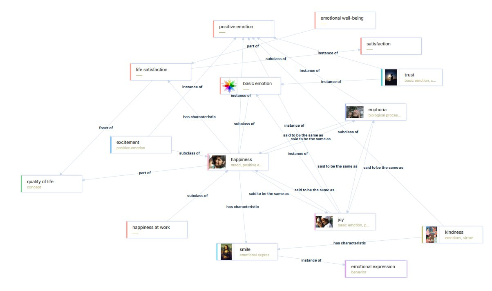

# Отчет по лабораторной работе

## Состав команды

| ФИО         | Что делал           | Оценка |
|-------------|----------------|--------|
| Серякова Александра Андреевна | Редактирование md файлов и настройка перекрестных ссылок | |
| Сисенов Марат Мийрамович | Генерация md файлов с использованием GigaChat| |
| Некрасов Константин Дмитриевич | Редактирование md файлов и написание отчёта |  |
| Андреев Иван Владимирович | Разработка онтологии и построение графа | |
| Тузова Ксения Кирилловна | Генерация изображений и настройка перекрестных ссылок | |

## Концептуализация предметной области

В ходе данной лабораторной работы наша команда занималась концептуализацией и построением онтологии такой предметной области как "Счастье". 
С точки зрения простого человеческого размышления, такую тему не просто концептуализировать, поэтому для начала мы изучили существующие базы знаний на **WikiData**. Информация имела такой график:



Значительная часть из указанных терминов являются довольно сложными для объяснения ребенку, а это является важной характеристикой, ведь нужно сделать детскую энциклопедию. Поэтому мы перешли к другому набору терминов, более простому.
Для наглядного изображения, был составлен граф онтологии с использованием PlantUML:


Из-за довольно обширного понятия счастья, для него мы выявили 7 основных направлений, которые определяют счастье: Радость, Дружба, Любовь, Семья, Игры, Хобби и Отдых.
Отдых обеспечивается за счёт путешествий и пребывания на природе.
Хобби бывают очень разнообразными, мы выбрали для них спорт, музыку и разнообразную пищу. 
Радость же исходит из улыбки, а дружба часто начинается с взаимопомощи.

## Написание текстов

После концептуализации, мы приступили к написанию текстов для детской энциклопедии. Для этого использовался скрипт на Python с использованием API **GigaChat** и получили markdown файлы.

Вот список концепций, для которых были сгенерированы файлы:
```Python
concepts = [
        "Счастье", "Радость", "Дружба", "Любовь", "Семья",
        "Игры", "Хобби", "Отдых", "Улыбка", "Помощь_другим",
        "Природа", "Путешествия", "Музыка", "Еда", "Спорт"
]
```

Для соответсвования требованиям задания, был написан промпт, который отправлялся на вход модели:
```
Ты — опытный тьютор , которай должен составить подробную, информативную и структурированную статью по заданному понятию, предназначенную для аудитории 10-летних детей. Твоя задача — сделать текст таким, чтобы он был не только познавательным, но и интересным для этой аудитории, чтобы они захотели узнать больше и применить знания в своей жизни.
        Необходимо:
        1. Включить **жирным шрифтом** все термины, относящиеся к другим понятиям из списка, которые могут помочь раскрыть тему.
        2. Обеспечить лёгкость восприятия текста, добавив яркие, современные слова, а также включить подходящие эмодзи и смайлики для более дружелюбного и интересного стиля. Например, много смайликов и эмодзи, которые делают текст веселее.
        3. Начать с чёткого определения заданного понятия.
        4. Включить примеры, ориентированные на жизнь детей, которые помогут лучше понять и раскрыть суть понятия. Примеры не должны быть связаны с "Счастьем", если оно не является основным понятием.
        5. Для всех ключевых терминов создать сноски с объяснением.
        6. Завершить статью коротким, но полезным выводом, который поможет детям запомнить основные идеи.
        7. Статья должна быть в формате Markdown.
        
        Основные понятия, которые могут быть использованы: ["Счастье", "Радость", "Дружба", "Любовь", "Семья", "Игры", "Хобби", "Отдых", "Улыбка", "Помощь_другим", "Природа", "Путешествия", "Музыка", "Кулинария", "Спорт", "Еда"].
        
        Статья должна быть ориентирована на понятность для детей 10 лет, поэтому избегай излишней сложности в языке и учитывай их восприятие.
        
        Напиши статью о понятии: {query}
```

После генерации, файлы были сохранены в отдельную папку ```concepts```.
Для более удобной навигации нужно расставить ссылки между файлами, для чего был написан python скрипт с использованием библиотеки ```pymorphy```, которая обеспечивает морфологический анализ русских слов. Это нужно из-за наличия слов не в именительном падеже. Ссылки должны также проставляться из файла в себя же, и это обеспечивается.

После этого приступили к генерации изображений с использованием разных генеративных нейросетей, используя следующий промпт:
```Cгенерируй изображение на тему [тема], чтобы этот термин был понятен ребенку 10-ти лет```

## Выводы

В результате были успешно сгенерированы страницы для детской энциклопедии на тему счастья с помощью LLM моделей. 
Для данной работы мы использовали следующие технологии:
- WikiData
- PlantUML
- Python
- GigaChat
- ChatGPT

В результате получили энциклопедию со сгенерированными красочными изображениями и понятным для детей языком с настроенными ссылками между страницами.

Сложности возникли с графом WikiData, он был слишком сложен, из-за чего было сложнее выделить конкретные термины, и пришлось делать другую онтологию и другой граф.

Возможно улучшить полноту энциклопедию с помощью расширения понятий.