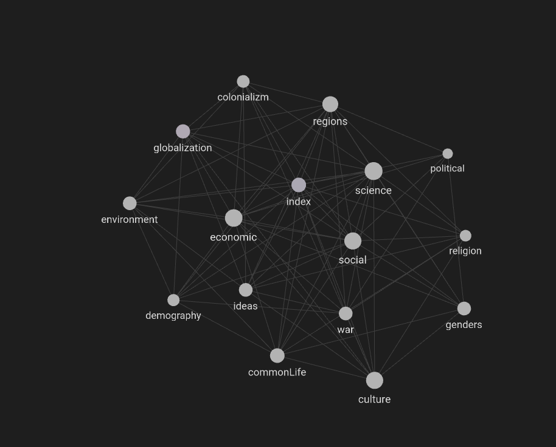

# Отчет по лабораторной работе

## Состав команды

| ФИО         | Что делал           | Оценка |
|-------------|----------------|--------|
| Бучкин Тимур Артемович| Всё |      |

## Концептуализация предметной области

Для выделения понятий из категории "история человечества" я использовал LLM. Просто попросил выделить 15 основных понятий и все. Список понятий можно посмотреть в файле [index.md][../../../KIDBOOK/world/history/index.md]

## Написание текстов

Написание тестов также проводил через LLM, сначала я закинул промпт, где каждому понятию сопоставил файл, на который нужно ссылаться.

Дальше для каждого понятия составлял одинаковый промпт: "Объясни для десятилетнего ребенка термин *понятие*. И расставь там ссылки по категориям выше"

Проблема оказалась в том, что LLM не могла расставить markdown ссылки, сколько бы я не просил и не объяснял как это делать. Все ссылки были просто `<a/>` html тегами, хотя адреса ссылок и были правильными. Поэтому я пошел на хитрость: сохранил html код ответа в файл, потом создал скрипт, который с с использованием библиотеки beautifulsoup4 парсил этот код, менял `<a/>` теги на markdown ссылки и записывал в выходной файл(preprocessHtml.py, preprocessRawFiles.py)

Дальше уже можно запустить obsidian, и там будет рабочая онтология:

Для соединения с другими командами, я еще сделал скрипт для парсинга ссылок из получившихся файлов(parseLinks.py) и записал эти ссылки в concepts.json

## Выводы

В общем LLM очень сильно облегчает творческий процесс(сама придумала термины и сама их описала, красота). Дальше уже технические части, чтобы автоматически спарсить данные, расставить ссылки и т.д. и т.п.

В качестве улучшения можно добавить использование API для создания запросов. Я редко пользуюсь LLM для учебы и работы, поэтому мне было лень разбираться с ним. Впрочем, если без этого совсем никак, то могу и на использование API переделать.

Также прикладываю файл диалога с LLM(Там часть html кода, где расположен сам диалог, его, по идее можно через любой viewer html посмотреть)
