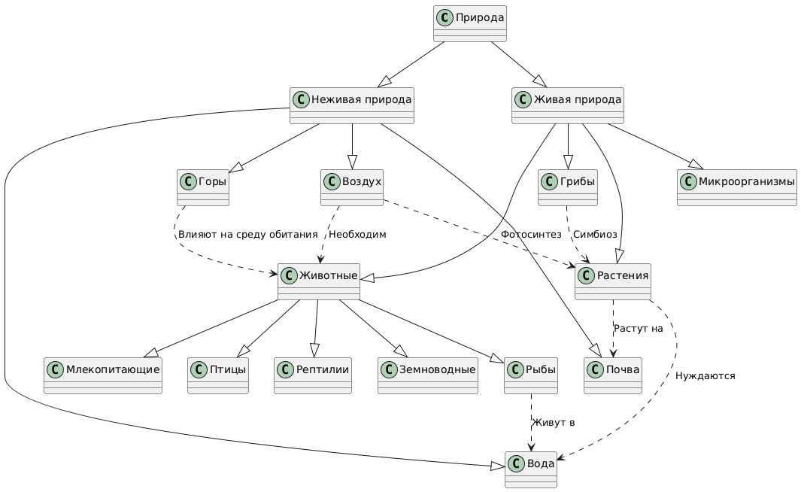

# Отчет по лабораторной работе

## Раздел - Природа

## Состав команды

| ФИО         | Что делал           | Оценка |
|-------------|----------------|--------|
| Калуцкий Максим Витальевич | Выбор понятий; Реализация понятий 1-4 |      |
| Брюханов Захар Дмитриевич  | Реализация понятий 5-8; Написание отчета | |
| Начкебия Руслан Шукуриевич | Реализация понятий 9-12; Написание отчета |  |
| Крутых Роман Вячеславович  | Реализация понятий 13-15; Написание скрипта для прокидывания ссылок | |

## Концептуализация предметной области

Концептуализация осуществлялась через ChatGPT, промт выглядел вот так:
```
Нужно создать детскую энциклопедию. Предметная область - природа. Также нужно учесть, что предметная область должна быть понятна даже 10 летнему ребёнку. Концептуализация раздела должна включать в себя не менее 15 понятий.
```
**Список понятий:**
1. Природа
2. Живая природа
3. Неживая природа
4. Растения
5. Животные
6. Грибы
7. Микроорганизмы
8. Вода
9. Воздух
10. Горы
11. Почва
12. Млекопитающие
13. Птицы
14. Рыбы
15. Рептилии

**Связи между объектами:**

**Иерархические связи**
- "Природа" делится на "Живую природу" и "Неживую природу".
- "Живая природа" включает в себя "Растения", "Животных",  "Грибы" и "Микроорганизмы".
- "Животные" подразделяются на "Млекопитающих", "Птиц", "Рыб", "Рептилий" и "Земноводных".

**Горизонтальные связи**
- "Растения" зависят от "Почвы" и "Воды".
- "Воздух" необходим для жизни "Животных" и "Растений".
- "Грибы" могут взаимодействовать с "Растениями" (симбиоз, паразитизм).
- "Рыбы" обитают в "Воде".
- "Горы" могут влиять на климат и распространение "Животных".



## Написание текстов

Написание текстов мы делали через LLM программно, промт выглядел вот так:
```
Мне нужно создать детскую инциклопедию, в которой будут раскрты следующие понятия:
1. Природа
2. Живая природа
3. Неживая природа
4. Растения
5. Животные
6. Грибы
7. Микроорганизмы
8. Вода
9. Воздух
10. Горы
11. Почва
12. Млекопитающие
13. Птицы
14. Рыбы
15. Рептилии
Также между этими понятиями имеются вот такие связи: (указание связей).
Тебе нужно раскрыть каждое понятие в отдельном файле .md, причем тебе также необходимо вставлять внутренние ссылки на другие файлы, если такая связь существует. Также учти, что содержимое должно быть ориентировано на ребёнка лет 10.
Ссылки, которые не были проставлены мы проставляли руками.
```

### Проставление ссылок

Часть ссылок была построена уже при генерации статей. Однако мы столкнулись с проблемой, что LLM не смог полностью справить с задачей и нам пришлось писать скрипт, использующий регулярные выражения. Он считывал названия файлов из `concept.json`, а далее создает словарь связей и обходит все файлы `.md`, находя в них ключевые слова и заменяя их на внутреннюю ссылку. Однако наш скрипт не учитывал падежи слов и поэтому в некоторых местах на пришлось проставлять ссылку вручную.


## Выводы

Проделав данную работу, нам удалось сделать детскую инциклопедию, сгенерировав для нее содержимое через LLM и ИИ. Для этого нам пришлось составить подробные и грамотные запросы.
Также мы столкнулись с проблемой расставления ссылок, однако частично нам удалось её решить, используя написанный скрипт, однако в качестве улучшения, можно доработать его так, чтобы он обрабатывал слова даже в тех случаях, когда они в тексте встречаются в других падежах и формах.

