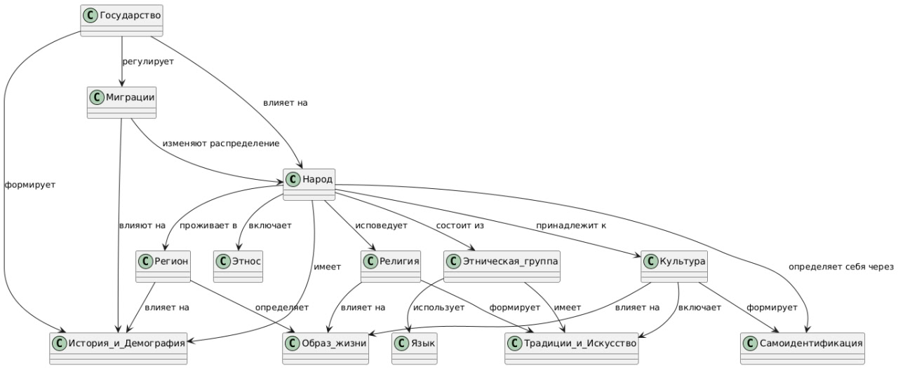

-----

# Отчет по лабораторной работе: Детская энциклопедия "Народы мира"

## Состав команды

| ФИО              | Что делал                                                                     | Оценка |
| ---------------- | ----------------------------------------------------------------------------- | ------ |
| Мышкина Варвара  | 8 терминов, написание отчёта                                                  |        |
| Снегирёв Дмитрий | 7 терминов, автоматическое проставление перекрёстных ссылок, концептуализация |        |

### Введение

Наш проект был посвящен созданию интерактивного раздела детской энциклопедии, сосредоточенного на теме "Народы мира". Цель заключалась в разработке доступных и увлекательных материалов для юных читателей (8-12 лет), объясняющих ключевые аспекты этнического и культурного многообразия нашей планеты. Работа велась в соответствии с заданными этапами, начиная от выбора концепций и заканчивая технической реализацией системы перекрестных ссылок.

### Формирование Концептуальной Модели

Первым шагом стало определение ключевых понятий, которые легли в основу нашего раздела. Изначальный список был создан с помощью технологии больших языковых моделей (LLM), охватывая основные и наиболее значимые аспекты: "Народ", "Культура", "Язык". В дальнейшем, для расширения и углубления содержания, мы обратились к Wikidata как к источнику структурированных знаний.

Центральным элементом нашей онтологии стало понятие "Народ", вокруг которого выстраивались все остальные концепции. Используя сервисы запросов Wikidata (SPARQL-запросы), мы дополнили начальный набор терминами, отражающими динамику и многообразие человеческого общества, такими как "Миграции", а также культурные элементы: "Национальный костюм", "Национальная кухня", "Праздники", "Традиционные жилища" и "Народное искусство". Это позволило создать комплексную семантическую сеть, отражающую взаимосвязи между всеми понятиями.

Визуализация нашей онтологии представлена ниже:

Для обеспечения информационного наполнения каждой концепции мы использовали SPARQL-запросы к Wikidata. Эти запросы позволяли извлекать релевантные данные, такие как идентификаторы сущностей и их краткие описания, которые затем передавались LLM-модели. Это помогало ИИ генерировать более точные и информативные объяснения для детей.

### Создание Содержания

Для генерации текстовых описаний для каждой концепции мы прибегли к помощи передовых генеративных моделей ИИ (LLM). Главной задачей было адаптировать сложную информацию таким образом, чтобы она была понятна и интересна десятилетнему ребенку.

Мы использовали следующий промпт для ИИ:
"Сформируй объяснение текста в формате MarkDown для десятилетнего ребенка, максимально используя возможности разметки MarkDown."

Помимо генерации основного контента, LLM также помогла нам в первоначальной разработке списка концепций, который затем был уточнен и систематизирован на основе данных из Wikidata и нашего понимания предметной области.

Для повышения удобства навигации и связности энциклопедии, был разработан Python-скрипт, отвечающий за автоматическое создание внутренних ссылок между страницами. Этот скрипт был усовершенствован для работы с русским языком, включая базовую обработку различных форм слов (падежей), что позволило более эффективно связывать соответствующие термины в тексте.

### Заключение

Проект по созданию детской энциклопедии "Народы мира" стал ценным опытом в области организации знаний и разработки образовательного контента.

Мы успешно продемонстрировали, как интегрированный подход, сочетающий возможности больших языковых моделей, структурированные данные из баз знаний (Wikidata) и автоматизированные программные инструменты (Python-скрипты), может быть использован для создания качественных и интерактивных информационных продуктов. Несмотря на некоторые технические сложности, особенно связанные с морфологическим анализом для скрипта ссылок, мы смогли успешно реализовать поставленные задачи.

Результатом нашей работы является увлекательная и познавательная энциклопедия, которая доступно рассказывает детям о многообразии народов и их культур, способствуя расширению их кругозора и пониманию мира.