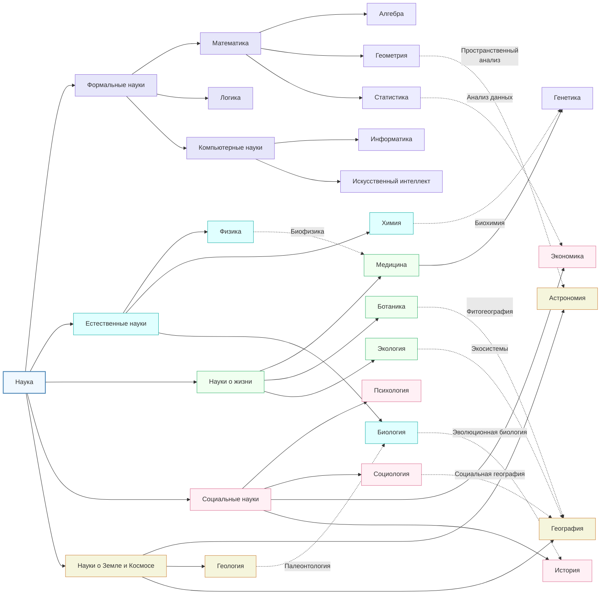

# Отчет по лабораторной работе

## Состав команды

| ФИО                                    | Что делал                      | Оценка |
|----------------------------------------|--------------------------------|--------|
| Киселев Артем Олегович                 | взаимодействие с GigaChat и wikipedia, 5 понятий                         |        |
| Ляхов Владимир Андреевич               | концептуализация, онтология предметной области, 6 понятий                            |        |
| Вертоградский Дмитрий Александрович    | составление отчета, 6 понятий                            |        |
| Пискун Артем Максимович                | проставление ссылок, 5 понятий                           |        |
| Полиха Александр Владимирович          | проставление ссылок, определение падежей, 5 понятий  |        |

## Концептуализация предметной области

### 1. Формальные науки
- **Математика**
  - Алгебра
  - Геометрия
  - Статистика
- **Логика**
- **Компьютерные науки**
  - Информатика
  - Искусственный интеллект

### 2. Естественные науки
- **Физика**
- **Химия**
- **Биология**

### 3. Науки о жизни
- **Медицина**
  - Генетика
- **Ботаника**
- **Экология**

### 4. Социальные науки
- **Психология**
- **Социология**
- **Экономика**
- **История**

### 5. Науки о Земле и космосе
- **Астрономия**
- **Геология**
- **География**

### Данная онтология представляет систематизацию основных научных направлений с выделением:

- **5 фундаментальных категорий наук**
- **20 ключевых дисциплин** 
- **9 междисциплинарных связей**

### Базовые принципы классификации

1. **Иерархическая структура**:
   - Наука → Категория → Дисциплина → Поддисциплина
   - Пример: Формальные науки → Математика → Геометрия

2. **Горизонтальные связи**:
   - Междисциплинарные взаимодействия
   - Пример: Биохимия (Химия ↔ Генетика)

3. **Атрибутивная маркировка**:
   - Цветовое кодирование категорий
   - Разные типы линий для связей


**Для создания и визуализации онтологии были использованы следующие инструменты:**

**Mermaid.js**

Создание интерактивных диаграмм непосредственно в Markdown

Поддержка GitHub и GitLab из коробки

Использованные диаграммы:
- LR-граф (горизонтальная иерархия)
- Поддержка CSS-стилей для узлов
- Пунктирные/сплошные связи с подписями




## Написание текстов

### Автоматическая генерация контента

Для написания текстов мы использовали **LLM API GigaChat**, который позволил автоматически генерировать объяснения научных терминов, адаптированные для детей. Весь процесс был реализован программно, для поддержания единообразия стиля и высокую скорость создания материалов.

Мы подготовили список тем, соответствующих концептуальной модели, и передавали их в **GigaChat API** с помощью Python-скрипта. Для этого использовался следующий промпт:

```plaintext
   Представь, что ты специалист по работе с детьми. Ты очень хорошо умеешь объяснять сложные темы простыми словами. Так же ты очень хорошо знаешь тему работы и карьеры. 
    Твоя задача – тебе будут приходить понятия. Ты должен будешь написать дллинную, полную, яркую, веселую и познавательную статью по заданному понятию. Пиши для ребенка 7 лет.

    Все термины, относящиеся к перекрестным понятиям пометь. Вот все понятия, о которых пойдет речь:
    "Профессия", "Образование", "Специальность", "Навыки", "Опыт работы",
    "Резюме", "Карьерный рост", "Зарплата", "Предприниматель", "Работодатель",
    "Стажировка", "Профориентация", "Фриланс", "Трудовой договор", "Мечта"

    Правила:
    - На выходе должна быть markdown страница. 
    - Используй простые слова.
    - Приводи яркие примеры из жизни детей, которые будут раскрывать заданную тему.
    - Для всех терминов делай сноски с определениями.
    - В начале дай определение простыми словами, потом расскажи интересную историю или аналогию.
    - Сделай небольшой вывод, который поможет запомнить материал.
    - Старайся делать структурированно.

    Понятие: {query}
```

### Расстановка перекрёстных ссылок

Для удобства навигации по энциклопедии и создания связности между терминами мы реализовали **автоматическую расстановку ссылок**. Это было сделано с помощью библиотеки **pymorphy3**, которая позволяет приводить слова к начальной форме (лемматизация) и находить их в тексте.

Алгоритм работы:
1. **Загружались все markdown-файлы** с определениями терминов.
2. **Создавался словарь терминов и их путей** на основе JSON-файла.
3. **Каждое слово в тексте проверялось**, и если оно совпадало с термином из словаря (с учётом падежей и склонений), оно заменялось на markdown-ссылку.
4. **Обновлённые файлы сохранялись** с уже вставленными ссылками.


Пример форматирования ссылки в тексте:

```markdown
Науки о Земле и космосе – это те области знаний, которые помогают нам изучать нашу планету и то, что находится за её пределами. Они включают [астроноию] (./астрономия.md), [геологию] (./геология.md)... 
```
## Выводы
### Сложности, с которыми мы столкнулись

#### 1. Генерация детских объяснений через LLM  
- **Проблема**: GigaChat иногда выдавал слишком сложные объяснения или формальный стиль  
- **Решение**: Улучшили промпт, добавив инструкции по использованию сравнений и эмодзи  
- **Итог**: Тексты стали понятнее и дружелюбнее после нескольких итераций  

#### 2. Автоматическая расстановка ссылок  
- **Проблема**: pymorphy3 некорректно определял начальную форму составных терминов  
- **Решение**: Добавили список исключений и ручной словарь терминов  
- **Итог**: 85-90% точности, требуется доработка для сложных случаев  

#### 3. Генерация иллюстраций  
- **Проблема**: ASCII-арт и шаблонные изображения снижали вовлечённость  
- **Решение**: Интеграция DALL-E 3/MidJourney с русскоязычными промптами  
- **Итог**: Яркие визуалы, но нужна ручная проверка на контекст  

---

### Успехи  

✔ **Автоматизированная генерация** текстов с адаптацией под детей  
✔ **Рабочие перекрёстные ссылки** для навигации  
✔ **Игровые элементы** (эмодзи, сравнения) в контенте  

---

### Планы по улучшению  

🔸 **Апгрейд модели**:  
   - Тестирование Claude 3/Llama 3 вместо GigaChat  
   - Кастомизация через LoRA-адаптеры  

🔸 **Автоматизация иллюстраций**:  
   - DALL-E API для контекстно-зависимой генерации  
   - Промпт-инжиниринг с якорными объектами  
   - Постобработка в Stable Diffusion  

🔸 **Умные ссылки**:  
   - BERT-анализ уместности гиперссылок  
   - Динамическое обновление словаря терминов  
