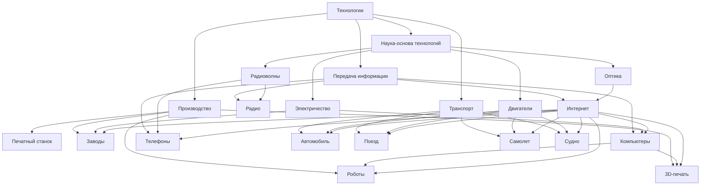

---

Мы разделили понятие «технологии» на четыре большие группы, отражающие, как вещи создаются, как передается информация, как люди перемещаются и как работают устройства, чтобы детально раскрыть тему для детской энциклопедии.

---

# **📄 Концептуализация главы "Технологии" для KIDBOOK**

## **🔹 Что такое технологии?**  
Технологии — это **изобретения и устройства, помогающие людям** в повседневной жизни, упрощающие задачи и расширяющие наши возможности. Благодаря технологиям мир стал более комфортным и увлекательным. В нашей концептуализации мы разбили понятие «технологии» на **четыре основные группы**:

1.  **Как создаются вещи?** – фабрики, станки, роботы и современные методы производства (например, 3D-печать).
2.  **Как передаётся информация?** – компьютеры, мобильные устройства, интернет и системы беспроводной связи.
3.  **Как люди перемещаются?** – транспортные средства: автомобили, поезда, самолёты и суда.
4.  **Как всё это функционирует?** – основы работы устройств, включая электричество, двигатели, радиоволны и оптику.

---

## **🏭 1. Как создаются вещи? (Производство)**  
💡 **Исторически люди создавали вещи вручную,** но с появлением механизмов процесс производства изменился до неузнаваемости. Теперь технологии позволяют изготавливать предметы быстрее, точнее и доступнее.

### **Примеры и их влияние:**  
- **Печатный станок:** революционизировал процесс копирования книг, что стимулировало распространение знаний.  
- **Фабрики и автоматизированное производство:** делают товары повседневной жизни доступными и качественными.  
- **Роботы:** применяются не только на производстве, но и в быту (например, уборочные роботы) и медицине (роботизированные системы для операций).  
- **3D-печать:** расширяет возможности изготовления в производстве, позволяя создавать уникальные детали и даже конструкции зданий.

---

## **💻 2. Как передаётся информация? (Передача информации)**  
💡 **Когда-то люди обменивались новостями через письма и личные встречи,** а сегодня информация перемещается по планете за доли секунды благодаря цифровым технологиям.

### **Примеры и их влияние:**  
- **Компьютеры:** являются универсальным инструментом для работы, обучения и творчества.  
- **Интернет:** объединяет мир, позволяя мгновенно делиться информацией, учиться онлайн и общаться с людьми по всему миру.  
- **Смартфоны и телефоны:** сделали общение мобильным, предоставляя доступ к информации буквально на ладони.  
- **Радио и беспроводные технологии:** легли в основу современных средств связи, таких как Wi-Fi и Bluetooth.

---

## **🚗 3. Как люди перемещаются? (Транспорт)**  
💡 **От простых повозок до современных автомобилей и самолётов — транспортные технологии радикально изменили наше представление о передвижении.**

### **Примеры и их влияние:**  
- **Автомобили:** обеспечивают индивидуальную мобильность и свободу перемещения, а современные электромобили способствуют заботе об экологии.  
- **Поезда:** являются надёжным способом перевозки больших групп людей и грузов на большие расстояния.  
- **Самолёты:** позволяют преодолевать огромные расстояния за считанные часы, открывая возможности для международного общения и туризма.  
- **Суда:** играют важную роль в мировой торговле, туризме и исследовании океанов.

---

## **⚡ 4. Как всё это функционирует? (Наука-основа технологий)**  
💡 **Наука является основой для всех технологических достижений.** Фундаментальные принципы физики и химии позволяют нам создавать и совершенствовать устройства, которыми мы пользуемся ежедневно.

### **Примеры и их влияние:**  
- **Электричество:** обеспечивает работу практически всех современных технологий — от лампочек до суперкомпьютеров.  
- **Двигатели:** приводят в движение транспортные средства, делая возможным перемещение людей и грузов.  
- **Радиоволны:** лежат в основе систем беспроводной связи, от радио до GPS-навигации.  
- **Оптика:** используется в технологиях от камер и телескопов до лазерной хирургии и систем распознавания лиц.

Такое разделение помогает детям понять, как технологии охватывают все аспекты нашей жизни, от создания предметов до их работы, и как они связаны между собой, образуя целостную систему инноваций.

---

## **🔗 Как все группы технологий взаимосвязаны?**

Технологии не существуют изолированно — они **взаимодействуют, дополняют и усиливают друг друга**, образуя сложную систему, где достижения одной области стимулируют прогресс в другой. В нашей обновлённой схеме связи между понятиями установлены следующим образом:

- **Электричество** является базовым источником энергии:
  - Оно обеспечивает работу **заводов**, где создаются предметы с использованием как традиционных методов, так и современных технологий.
  - Оно питает **компьютеры**, позволяющие обрабатывать данные и управлять процессами производства и связи.
  - Оно приводит в действие **автомобили** и другие транспортные средства, делая возможным перемещение людей и грузов.

- **Двигатели** напрямую отвечают за движение всех видов транспорта:
  - Они используются в **автомобилях**, **поездах**, **самолётах** и **суднах** для обеспечения эффективного и надёжного передвижения.
  - Контроль работы двигателей часто осуществляется с помощью компьютерных систем, что связывает их с информационными технологиями.

- **Радиоволны** — основа беспроводной связи:
  - Они обеспечивают передачу сигналов для **телефонов** и **радио**, создавая возможность мгновенной связи.
  - С их помощью также функционирует **интернет**, соединяя компьютеры и позволяя управлять процессами дистанционно.

- **Оптика** играет важную роль в совершенствовании технологий:
  - Она применяется в **3D-печати** для контроля качества и точности изготовления деталей.
  - Системы оптического зрения интегрируются в **роботов**, улучшая их способность ориентироваться в пространстве и выполнять сложные задачи.
  - Оптичес технологии также улучшают качество камер в **телефонах**, способствуя развитию мобильных коммуникаций.

- **Компьютеры и интернет** являются «мозгом» современных технологий:
  - Компьютеры управляют **роботами** и процессами **3D-печати**, повышая эффективность производства.
  - Интернет объединяет информационные системы, позволяя заводам и транспортным средствам работать в синхронном режиме, а также обеспечивает связь между пользователями и устройствами.

Таким образом, каждая группа технологий тесно переплетается с другими: энергия, управление и инновации создают взаимозависимую сеть, где успех в одной области способствует развитию остальных.

---

## **🔍 Визуализация**
Mermaid:

---
PlantUML:

