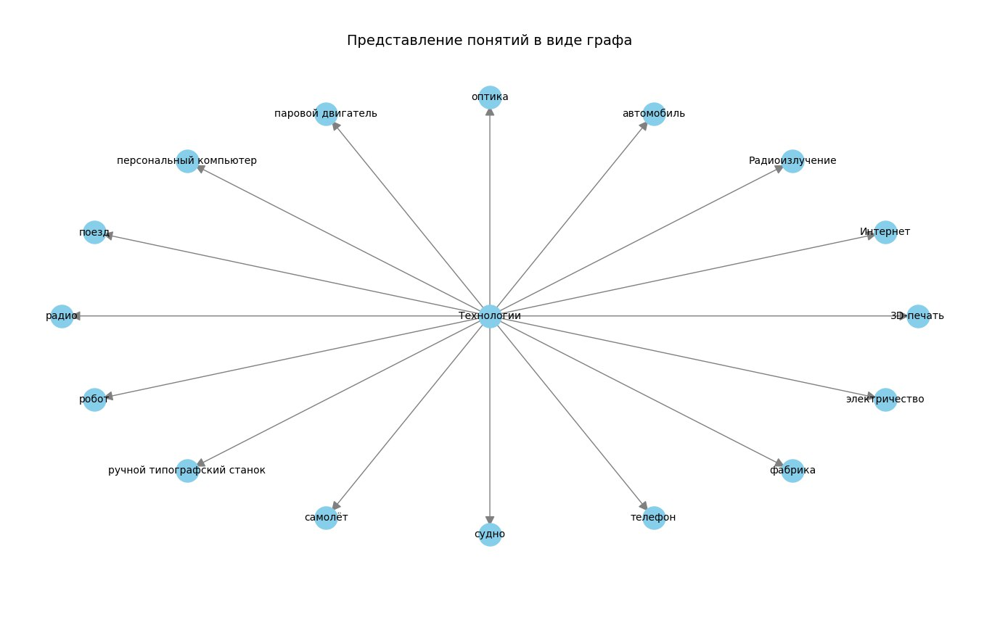
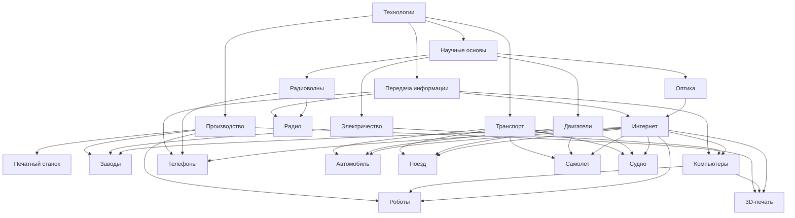

# Отчет по лабораторной работе

## Состав команды

| ФИО         | Что делал           | Оценка |
|-------------|----------------|--------|
| Останина Анна Андреевна         | Отчет, концептуализация, SPARQL-запрос |      |
| Ибрагимов Роман Рифхатович         | Отчет, API генерация файлов | |
| Тюмин Данила Ярославович         | Отчет, ссылки и падежи |  |
| Юнусов Рустам Кобилович         | Генерация изображений | |
| Бонокин Данил Сергеевич            | Генерация изображений | |

## Концептуализация предметной области
---

Мы разделили понятие «технологии» на четыре большие группы, отражающие, как вещи создаются, как передается информация, как люди перемещаются и как работают устройства, чтобы детально раскрыть тему для детской энциклопедии.

---

### **Концептуализация раздела "Технологии"**

#### **Что такое технологии?**  
Технологии — это **изобретения и устройства, помогающие людям** в повседневной жизни, упрощающие задачи и расширяющие наши возможности. Благодаря технологиям мир стал более комфортным и увлекательным. В нашей концептуализации мы разбили понятие «технологии» на **четыре основные группы**:

1.  **Как создаются вещи?** – фабрики, станки, роботы и современные методы производства (например, 3D-печать).
2.  **Как передаётся информация?** – компьютеры, мобильные устройства, интернет и системы беспроводной связи.
3.  **Как люди перемещаются?** – транспортные средства: автомобили, поезда, самолёты и суда.
4.  **Как всё это функционирует?** – основы работы устройств, включая электричество, двигатели, радиоволны и оптику.

---

#### **1. Как создаются вещи? (Производство)**  
**Исторически люди создавали вещи вручную,** но с появлением механизмов процесс производства изменился до неузнаваемости. Теперь технологии позволяют изготавливать предметы быстрее, точнее и доступнее.
 
- **Печатный станок:** революционизировал процесс копирования книг, что стимулировало распространение знаний.  
- **Фабрики и автоматизированное производство:** делают товары повседневной жизни доступными и качественными.  
- **Роботы:** применяются не только на производстве, но и в быту (например, роботы-пылесосы) и медицине (роботизированные системы для операций).  
- **3D-печать:** расширяет возможности изготовления в производстве, позволяя создавать уникальные детали и даже конструкции зданий.

---

#### **2. Как передаётся информация? (Передача информации)**  
**Когда-то люди обменивались новостями через письма и личные встречи,** а сегодня информация перемещается по планете за доли секунды благодаря цифровым технологиям.
  
- **Компьютеры:** являются универсальным инструментом для работы, обучения и творчества.  
- **Интернет:** объединяет мир, позволяя мгновенно делиться информацией, учиться онлайн и общаться с людьми по всему миру.  
- **Смартфоны и телефоны:** сделали общение мобильным, предоставляя доступ к информации буквально на ладони.  
- **Радио и беспроводные технологии:** легли в основу современных средств связи, таких как Wi-Fi и Bluetooth.

---

#### **3. Как люди перемещаются? (Транспорт)**  
**От простых повозок до современных автомобилей и самолётов — транспортные технологии радикально изменили наше представление о передвижении.**
 
- **Автомобили:** обеспечивают индивидуальную мобильность и свободу перемещения, а современные электромобили способствуют заботе об экологии.  
- **Поезда:** являются надёжным способом перевозки больших групп людей и грузов на большие расстояния.  
- **Самолёты:** позволяют преодолевать огромные расстояния за считанные часы, открывая возможности для международного общения и туризма.  
- **Суда:** играют важную роль в мировой торговле, туризме и исследовании океанов.

---

#### **4. Как всё это функционирует? (Научные основы)**  
**Наука является основой для всех технологических достижений.** Фундаментальные принципы физики и химии позволяют нам создавать и совершенствовать устройства, которыми мы пользуемся ежедневно.
 
- **Электричество:** обеспечивает работу практически всех современных технологий — от лампочек до суперкомпьютеров.  
- **Двигатели:** приводят в движение транспортные средства, делая возможным перемещение людей и грузов.  
- **Радиоволны:** лежат в основе систем беспроводной связи, от радио до GPS-навигации.  
- **Оптика:** используется в технологиях от камер и телескопов до лазерной хирургии и систем распознавания лиц.

Такое разделение помогает детям понять, как технологии охватывают все аспекты нашей жизни, от создания предметов до их работы, и как они связаны между собой, образуя целостную систему.

---

#### **Как все группы технологий взаимосвязаны?**

Технологии не существуют изолированно — они **взаимодействуют, дополняют и усиливают друг друга**, образуя сложную систему, где достижения одной области стимулируют прогресс в другой. 

Сначала мы реализовали граф с помощью SPARQL и python.

Затем попробовали сделать схему с помощью Mermaid. Но схема получилась совершенно неудобной для восприятия.

Визуализация в Mermaid:

По итогу мы пришли к PlantUML, где у нас получилась более понятная и красочная схема.
Четыре группы имеют разные цвета. При этом самые важные понятия дополнительно выделили цветом: 
- **Наука**: зеленые оттенки (природа, фундаментальность).
- **Технологии**: синие/голубые (возникает ассоциация с цифровым миром).
- **Производство**: теплые цвета (металл, энергия).
- **Транспорт**: бежевые/нейтральные (универсальность).

Визуализация в PlantUML:

Разберемся, какие связи присутствуют в таблице:

| Взаимосвязь                 | Тип связи                                  | Обоснование                                                                                                 |
|-----------------------------|--------------------------------------------|-----------------------------------------------------------------------------------------------------------|
| Компьютеры (C1) -> Роботы (B3) | Управляет / является системой управления для | Компьютеры используются для программирования и управления действиями роботов.                            |
| Компьютеры (C1) -> 3D-печать (B4) | Управляет / является системой управления для | Процесс 3D-печати контролируется компьютерным программным обеспечением.                                   |
| Интернет (C2) -> Заводы (B2) | Используется в / обеспечивает связь для    | Интернет используется на заводах для управления производством, логистики и связи. |
| Интернет (C2) -> Автомобиль (D1) | Интегрирован в / предоставляет функциональность для | Современные автомобили часто имеют доступ к интернету для навигации, развлечений и связи. |
| Интернет (C2) -> Поезд (D2)  | Интегрирован в / предоставляет функциональность для | В поездах может быть доступ к интернету для пассажиров, а также для ПО. |
| Интернет (C2) -> Роботы (B3) | Обеспечивает связь для / используется для удаленного управления | Роботы могут быть подключены к интернету для удаленного управления, мониторинга и обмена данными. |
| Интернет (C2) -> 3D-печать (B4) | Используется для / обеспечивает передачу данных для | Через интернет можно передавать файлы для 3D-печати и удаленно контролировать процесс. |
| Интернет (C2) -> Самолет (D3) | Интегрирован в / предоставляет функциональность для | В самолетах есть платный доступ к интернету для пассажиров, а также интернет использкется для ПО. |
| Интернет (C2) -> Судно (D4)  | Интегрирован в / предоставляет функциональность для | Суда могут иметь доступ к интернету для ПО и нужд экипажа. |
| Электричество (E1) -> Заводы (B2) | Фундаментальная зависимость               | Заводы требуют электроэнергии для работы оборудования, освещения и других процессов.                     |
| Электричество (E1) -> Компьютеры (C1) | Фундаментальная зависимость               | Компьютеры полностью зависят от электропитания для своего функционирования.                              |
| Двигатели (E2) -> Автомобиль (D1) | Является частью / приводит в движение      | Двигатель является основным источником энергии, обеспечивающим движение автомобиля.                      |
| Двигатели (E2) -> Поезд (D2)   | Является частью / приводит в движение      | Двигатель (или несколько) обеспечивает тягу, необходимую для движения поезда.                            |
| Двигатели (E2) -> Самолет (D3) | Является частью / приводит в движение      | Двигатели создают тягу, необходимую для взлета и полета самолета.                                         |
| Двигатели (E2) -> Судно (D4)   | Является частью / приводит в движение      | Двигатель (или несколько) используется для перемещения судна по воде.                                    |
| Радиоволны (E3) -> Телефоны (C3) | Технология используется в                 | Телефоны используют радиоволны для беспроводной передачи информации (разговор по телефону, сообщения и т.д. |                       |
| Радиоволны (E3) -> Радио (C4)  | Технология используется в                 | Радиовещание основано на передаче и приёме аудиосигналов с помощью радиоволн.          |
| Оптика (E4) -> Интернет (C2)   | Является основой для / ключевая технология в | Волоконно-оптические кабели, основанные на принципах оптики, составляют основу высокоскоростной передачи данных в сети интернет. |

Таким образом, каждая группа технологий тесно переплетается с другими: энергия, управление и инновации создают взаимозависимую сеть, где прогресс в одной области способствует развитию остальных.

## Написание текстов

Для написания текстов решили использовать GigaChat API с использованием модели GigaChat-2-Max.

В начале использовали простые запросы с базовой моделью для облегченной разработки.   Далее пришли к такому варианту запросов:  
""" 
Ты — талантливый детский писатель и педагог с 20-летним опытом. Напиши главу о "{concept}" для энциклопедии "Удивительный мир вокруг нас", предназначенной для любознательных 10-летних читателей

Инструкции:

1. Введение: Напишите краткое и понятное определение '{concept}', выделив самое важное, чтобы ребенок смог легко понять суть.

2. История: Расскажите увлекательную историю появления '{concept}', адаптированную для юного ума, чтобы вызвать интерес и понимание.

3. Принципы работы: Объясните, как работает '{concept}', раскрывая технические аспекты с учетом детских возможностей восприятия, избегая сложных терминов, но сохраняя важные детали.

4. Влияние: Опишите, какое влияние оказало '{concept}' на общество, делая акцент на примерах, которые ребенок может увидеть в своей повседневной жизни.

Правила:
- Напиши длинную главу
- Используй словарь 4-го класса.
- Добавляй эмодзи.
- Структурируй описание так, чтобы оно было понятно и интересно ребенку.   
""" 

Позже в запрос добавили пункт "Если будет полезно для раскрытия понятия упомянуть связь со следующими темами: [3D-печать, Интернет, Радиоизлучение, Автомобиль, Мобильный телефон, Оптика, Паровой двигатель, Персональный компьютер, Поезд, Радио, Робот, Ручной типографский станок, Самолёт, Судно, Телефон, Фабрика, Электричество]. Но не перегружай главу, если она уже достаточна сложная для понимания 10-ти летним ребенком" для того, чтобы ссылки расставлялись лушче. А 
А также пункт с интересным файлом.

Итоговый запрос:  
Ты — талантливый детский писатель и педагог с 20-летним опытом. Напиши главу о "{concept}" для энциклопедии "Удивительный мир вокруг нас", предназначенной для любознательных 10-летних читателей

Инструкции:

1. Введение: Напишите краткое и понятное определение '{concept}', выделив самое важное, чтобы ребенок смог легко понять суть.

2. История: Расскажите увлекательную историю появления '{concept}', адаптированную для юного ума, чтобы вызвать интерес и понимание.

3. Принципы работы: Объясните, как работает '{concept}', раскрывая технические аспекты с учетом детских возможностей восприятия, избегая сложных терминов, но сохраняя важные детали.

4. Влияние: Опишите, какое влияние оказало '{concept}' на общество, делая акцент на примерах, которые ребенок может увидеть в своей повседневной жизни.

5. Интересный факт: Для закрепления интереса к теме у юного читателя приведи реальный факт, который впечатлит юный ум читателя

Правила:
- Напиши длинную главу
- Используй словарь 4-го класса.
- Добавляй эмодзи.
- Структурируй описание так, чтобы оно было понятно и интересно ребенку.
- Если будет полезно для раскрытия понятия упомянуть связь со следующими темами: [3D-печать, Интернет, Радиоизлучение, Автомобиль, Мобильный телефон, Оптика, Паровой двигатель, Персональный компьютер, Поезд, Радио, Робот, Ручной типографский станок, Самолёт, Судно, Телефон, Фабрика, Электричество]. Но не перегружай главу, если она уже достаточна сложная для понимания 10-ти летним ребенком  
"""  

Ссылки в коде расставляются путем поиска терминов в тексте и замены их на гиперссылки вида [термин](файл#якорь). Для каждого термина учитываются все его словоформы с помощью морфологического анализатора pymorphy3.

## Выводы
В процессе выполнения лабораторной работы мы столкнулись с рядом трудностей, а именно: 
 - Не самое очевидное подключение к Gigachat API
 - Добавление ссылок - ссылки дублировались.
 - Эмодзи - GigaCHAT при первой попытке просто выводил набор эмодзи в конце файла.

Нашу работу можно улучшить, добавив больше понятий и сгенерированных изображений с помощью API.
